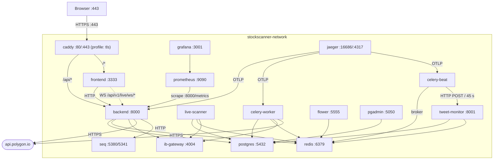
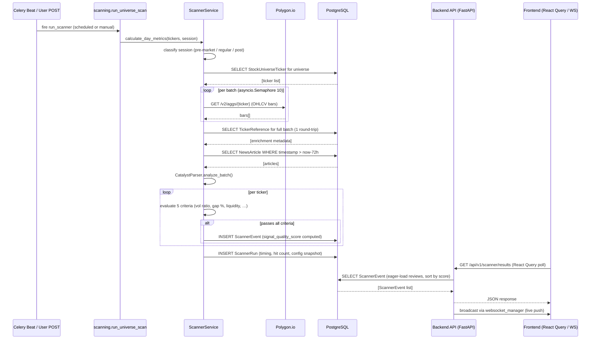
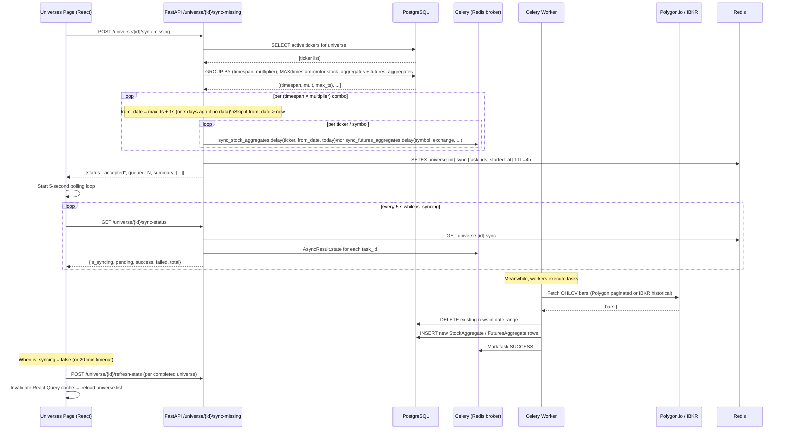

# Architecture

## Service Topology

All services run as Docker containers on the `stockscanner-network` bridge network. Inter-service communication uses container names as hostnames.



## Scan Execution Flow

A full pre-market scan proceeds as follows:

1. **Trigger** — Celery Beat fires `run_scanner` at a scheduled time, or a user POSTs to `/api/v1/scanner/run`.
2. **Session classification** — `ScannerService.calculate_day_metrics()` (`services/scanner.py`) determines the active market session (pre-market 04:00–09:30, regular, post-market) using `ZoneInfo("America/New_York")`, then maps session boundaries to UTC for database queries.
3. **Ticker list** — The service resolves the universe's ticker list from `StockUniverseTicker` records.
4. **Parallel data fetch** — Tickers are fetched from Polygon in batches. An `asyncio.Semaphore(10)` bounds concurrency to 10 in-flight requests; `asyncio.gather()` parallelises within that bound.
5. **Batch enrichment** — `_get_batch_enrichment_data()` fetches all `TickerReference` metadata for the full batch in a single DB round-trip (eliminates per-ticker N+1 queries).
6. **News catalyst analysis** — `CatalystParser.analyze_batch()` (`services/catalyst_parser.py`) queries the `NewsArticle` table once for a 72-hour window covering all tickers, then matches articles to tickers in memory.
7. **Criteria evaluation** — Each ticker is evaluated against the five scanner criteria (see README). Passing tickers produce `ScannerEvent` records.
8. **Persistence** — A `ScannerRun` row is written with metadata; `ScannerEvent` rows are written for each hit.
9. **Delivery** — The frontend polls `/api/v1/scanner/results` via React Query. Live pushes are broadcast through `services/websocket_manager.py`.



## Backend Module Map

### Core (`app/core/`)

| File | Responsibility |
|------|---------------|
| `config.py` | `Settings` class; reads all env vars with typed defaults. Accessed via `get_settings()` (cached). |
| `database.py` | Async SQLAlchemy engine and session factory (`AsyncSession`). `get_db()` dependency. |
| `celery_app.py` | Celery instance; beat schedule definitions (scan times, sync intervals). |
| `error_tracking.py` | `ErrorTracker` protocol; `SeqErrorTracker` and `StdoutErrorTracker` implementations; MD5-based `ErrorId` generation. |
| `rate_limits.py` | SlowAPI `limiter` instance + four tier constants: `GLOBAL_LIMIT` (100/min), `SCANNER_LIMIT` (5/min), `TRADING_LIMIT` (10/min), `AUTH_LIMIT` (5/min). Lives in `core/` (not `main.py`) to break the circular import from routers importing `limiter`. Redis db 1 storage when `RATE_LIMITING_ENABLED=true`. |
| `cache.py` | Application-level Redis caching. `get_redis()` — process-scoped `@lru_cache` singleton (sync `redis.Redis`, fast-fail timeouts). `get_cached(key, ttl, fn)` — read-through helper; transparent on Redis failure. `invalidate(key)`, `invalidate_pattern(pattern)` — cache busting. `@cache_response(key, ttl)` — convenience decorator for parameter-less GETs. All keys use `mh:` prefix. Applied to six hot endpoints: `scanner/types` (1h), `scanner/configs` (5min), `system/status` (30s), `system/storage` (5min), `universe/list` (1min), `stocks/details/{ticker}` (60s). |

### Exception Hierarchy (`app/exceptions.py`)

Domain-typed exceptions raised at service/provider public boundaries so callers always know what to catch. Each carries `is_retryable: bool` (drives Celery retry logic) and structured context fields for Seq filtering.

| Class | Raised by | Key context fields |
|-------|-----------|--------------------|
| `MarketHawkError` | Base — all domain errors | `is_retryable`, `**context` |
| `ScanError` | `ScannerService` | `scanner_type`, `universe_id`, `ticker`, `scan_id` |
| `DataFetchError` | `StockDataService` | `provider`, `symbol`, `timespan`, `date_range` |
| `ProviderError` | `IBKRDataProvider`, `MassiveDataProvider`, `FuturesDataService` | `provider`, `endpoint`, `status_code` |

`main.py` registers a `@app.exception_handler(MarketHawkError)` before the bare `Exception` handler: `is_retryable=True` → HTTP 503, `False` → HTTP 422.

### Services (`app/services/`)

| File | Responsibility |
|------|---------------|
| `scan_orchestrator.py` | Scanner registry and orchestrator. `ScannerDescriptor` frozen dataclass; `_REGISTRY` populated via `register()` at import time. `run(scanner_type, tickers, db, event_date)` is the single dispatch entry point from `tasks/scanning.py`. `get_all()` enumerates entries for `GET /api/v1/scanner/types`. `compute_next_run(scanner_type)` returns next scheduled fire time. `get_scan_progress(redis_url, universe_id, scanner_type)` reads Redis progress state. `request_scan_cancel(redis_url, scan_id)` sets Redis cancel flag. `enqueue_scan(db, request)` creates `ScannerRun` row and dispatches Celery task. |
| `scanner_query_service.py` | `ScannerQueryService` — DB aggregation queries extracted from `routers/scanner.py`. `get_scan_status_block()` builds the Scan Status card payload. `get_signal_quality_distribution()` computes decile outcome stats. `get_review_stats()` aggregates signal review coverage, acceptance rate, and rejection reasons. |
| `system_service.py` | `SystemService` — business logic extracted from `routers/system.py`. `get_market_status()` returns the current ET session. `check_ibkr_reachable()` socket probe. `format_bytes()` human-readable size. `get_storage_stats()` per-table PostgreSQL size queries. `get_active_tasks()` async Redis + DB poll for the `/ws/tasks` WebSocket. |
| `pre_market_scan.py` | Self-registers `"pre_market_volume_spike"` in the orchestrator. Contains the full `run_pre_market_scan()` async body: pre-market bar fetch, 19-key feature enrichment, volume-forecast, anomaly score, signal ranking, `_save_event`. Per-ticker `scanner.evaluate_ticker` OTel spans. Uses lazy imports for `ScannerService`/`_scanner_mod` to avoid circular import. |
| `oversold_bounce_scan.py` | Self-registers `"oversold_bounce"` in the orchestrator. Contains the full `run_oversold_bounce_scan()` async body: post-market/regular session bar fetch, RSI oversold + reversal detection, signal ranking, `_save_event`. Uses same lazy-import pattern as `pre_market_scan.py`. |
| `pocket_pivot.py` | Self-registers `"pocket_pivot"` in the orchestrator. Detects up-days where session volume exceeds the highest down-day volume in the prior 10 trading days (classic Morales/Kacher pocket pivot). Uses daily bars from `StockAggregate`. Runs nightly at 02:00 UTC via Celery beat. |
| `scanner.py` | Re-export facade for `ScannerService`. Delegates `calculate_day_metrics*` → `session_metrics`, `_get_batch_enrichment_data*` → `scan_enrichment`, `run_pre_market_scan`/`run_oversold_bounce_scan` → respective scan modules (lazy imports). `_save_event()`, `default_scan_date()`, `check_concurrency()`, `resolve_date_range()`, `count_active_tickers()` remain here. Re-exports `load_ranker_config`, `compute_anomaly_score`, `get_volume_forecast` so test patch targets (`app.services.scanner.*`) are preserved. |
| `session_metrics.py` | Module-level metric computation extracted from `ScannerService`. `calculate_day_metrics_from_aggs(aggs)` — classifies bars into pre/regular/post-market sessions and returns a 16-key metrics dict. `calculate_day_metrics(ticker, event_date, db)` — DB fetch wrapper. |
| `scan_enrichment.py` | Batch enrichment logic extracted from `ScannerService`. `_SECTOR_ETF_MAP`/`_SECTOR_ETF_SYMBOLS` constants. `_get_batch_enrichment_data()` — OTel-instrumented wrapper (`scanner.batch_enrichment` span). `_get_batch_enrichment_data_impl()` — 19-key enrichment: monitored stocks, ticker refs, splits, catalysts, ES/NQ context, sector ETF changes. |
| `signal_ranker.py` | Phase 2c signal quality scorer. `compute_signal_quality_score()` — weighted sum of normalized indicators (re-normalizes over present features). `load_ranker_config()` — reads `signal_ranker_enabled`, `signal_ranker_weights`, `signal_ranker_version` from `SystemConfig`. Weights updatable without redeploy. |
| `stock_data.py` | Historical OHLCV fetch, gap calculation, session flags. `is_futures_ticker()` — asset-class lookup. `get_historical_enriched()` — fetch + Decimal coercion + MAX_DATAPOINTS guard + indicator gating. |
| `universe_stats.py` | `UniverseStatsService.compute()` — aggregate stats for one universe (ticker count, bar count, date range, timespans) across both StockAggregate and FuturesAggregate. Callable outside HTTP context. |
| `universe_orchestrator.py` | Celery task dispatch, Redis state management, and multi-service coordination for universes. Six functions: `discover_and_refresh`, `sync_missing_aggregates`, `get_sync_status`, `sync_aggregates`, `queue_quality_analysis`, `queue_normalization`. Raises `UniverseNotFoundError`/`UniverseValidationError`; safe to call from Celery tasks. |
| `universe_export.py` | ZIP streaming for universe aggregate exports. `export_aggregates(universe_id, request, db)` — duck-typed request; builds per-ticker or single-CSV ZIP from StockAggregate + FuturesAggregate. No Celery or Redis dependencies. |
| `discovery_service.py` | Bulk ticker sync from Polygon: paginated reference data, rate-limit-aware batching. |
| `catalyst_parser.py` | Batch 72-hour news analysis for catalyst detection. Joins articles to tickers in memory. Returns `latest_article_utc` per ticker for catalyst recency enrichment. |
| `futures_data.py` | Re-export facade for `FuturesDataService`. `sync_contracts()`/`get_continuous_series()` are explicit method bodies that call `SessionLocal()` so `patch("app.services.futures_data.SessionLocal", ...)` test seams are preserved. All other methods delegate via `staticmethod(...)` to the four sibling modules below. |
| `futures_contracts.py` | Contract catalog sync extracted from `FuturesDataService`. `SYMBOL_EXCHANGE_MAP` (12 symbols → exchange). `_resolve_exchange(symbol)`. `FuturesContractService._sync_contract_catalog(db, symbol, exchange)` — IBKR query + 10-year cutoff filter + upsert. `FuturesContractService.sync_contracts(symbol)` — self-managed session wrapper. |
| `futures_aggregates.py` | Bar download and gap-fill extracted from `FuturesDataService`. `FuturesAggregatesService._download_contract()` — single-month IBKR bar fetch with dedup and batch commit. `_download_full_history()` — iterates all catalog contracts, detects rollovers, fills gaps. `_fill_data_gaps()` — scans stored bars for time gaps > `min_gap_hours` and re-downloads. |
| `futures_rollovers.py` | Rollover detection extracted from `FuturesDataService`. `CALENDAR_ROLL_DAYS_BEFORE_EXPIRY = 8`. `FuturesRolloversService._detect_rollovers(db, symbol, ...)` — iterates contract pairs, upserts `FuturesRollover` rows. `_detect_single_rollover()` — volume-crossover or calendar fallback for one pair. `_build_time_slices(rollovers, first_contract)` — converts rollover list into `(start, end, contract_month)` triples for continuous-series assembly. |
| `futures_series.py` | Continuous series assembly extracted from `FuturesDataService`. `FutureSeriesService.get_continuous_series(symbol, ...)` — self-managed session, calls `_get_continuous_series_with_db`. `_get_continuous_series_with_db(db, symbol, ...)` — queries `FuturesRollover` + `FuturesContract`, builds time slices, stitches per-slice SQL queries into a deduplicated `pd.DataFrame`. |
| `chart_indicators.py` | Technical indicator computation (e.g., VWAP, moving averages) for chart endpoints. |
| `journal_service.py` | Trade journal CRUD operations. |
| `websocket_manager.py` | WebSocket connection pool; `broadcast()` to all connected clients. |
| `normalization.py` | Data normalization helpers (price/volume units, split adjustments). |
| `data_quality.py` | Quality checks and `UniverseQualityReport` generation. |
| `auto_trade_service.py` | `AutoTradeExecutor` — full auto-trade lifecycle (guard checks, sizing, IBKR submission). `approve_order(order, strategy, db)` handles paper vs. live approval. `cancel_order(order, db)` cancels via IBKR or marks paper cancelled. `get_account()` fetches IBKR account summary with graceful fallback. `get_stats(db, days)` computes P&L, win rate, and status breakdown. |
| `stats.py` | Aggregate statistics helpers for dashboard metrics. |
| `event_helpers.py` | Utility functions for `ScannerEvent` construction and querying. |
| `statistical_discovery.py` | Pure-Python statistical analysis service: `build_feature_matrix`, `compute_correlations` (Pearson + Spearman), `compute_shap_weights` (LightGBM + SHAP), `run_kmeans`, `compute_conditional_stats`, `generate_label`. No DB dependencies; accepts DataFrames, returns typed dicts. |

### Providers (`app/providers/`)

| File | Responsibility |
|------|---------------|
| `base.py` | `BaseDataProvider` sync abstract interface: `get_bars()`, `get_snapshots()`, `get_ticker_details()`. All providers must implement this contract. |
| `massive.py` | Polygon.io provider: `get_bars()` (paginated OHLCV), `get_snapshots()` (normalised market snapshot dicts), large-batch ticker sync, aggregate backfill. |
| `ibkr.py` | `ib_insync`-based Interactive Brokers provider. Futures-only (`get_bars`/`get_snapshots` return empty stubs). Connects to the `ib-gateway` container on port 4002. |

### Routers (`app/routers/`)

| File | Endpoints |
|------|-----------|
| `auth.py` | `GET /api/auth/status` (bootstrap check), `POST /api/auth/register` (first-user only), `POST /api/auth/login` (sets HttpOnly JWT cookies), `POST /api/auth/logout`, `POST /api/auth/refresh`, `GET /api/auth/me` |
| `scanner.py` | `/api/v1/scanner/run`, `/api/v1/scanner/results` (eager-loads reviews, default sort: `signal_quality_score DESC`; supports `start_date`/`end_date` filters), `/api/v1/scanner/history`, `/api/v1/scanner/signal-quality-distribution`, `POST /api/v1/scanner/events/{uuid}/review` (submit verdict), `GET /api/v1/scanner/events/reviews?scanner_type=` (list with `liquidity_hunt` alias), `GET /api/v1/scanner/reviews/stats` (coverage, acceptance rate, by-type breakdown) |
| `universe.py` | `/api/v1/universe/*` — CRUD for stock universes and memberships |
| `stocks.py` | `/api/v1/stocks/*` — historical data, ticker search, stock details |
| `news.py` | `/api/v1/news/*` — news articles and preferences |
| `live_data.py` | `/api/v1/live/ws/{ticker}/{resolution}` — per-symbol WebSocket; `/api/v1/live/ws/watchlist` — watchlist-wide WebSocket (all symbols + alerts) |
| `futures.py` | `/api/v1/futures/*` — `GET /history/{symbol}`, `GET /contracts/{symbol}`, `GET /rollovers/{symbol}`, `POST /download/{symbol}` (catalog refresh), `GET /providers` |
| `journal.py` | `/api/v1/journal/*` — trade journal entries |
| `watchlist.py` | `/api/v1/watchlist/*` — active watchlist CRUD (list, add, update notes, remove) |
| `health.py` | `GET /api/health` — liveness probe (unversioned; consumed by Docker and monitoring tools) |
| `system.py` | `/api/v1/system/*` — configuration, status |
| `outcomes.py` | `/api/v1/outcomes/*` — scorecard, intervals, distribution, edge decay, signals, event detail, backfill; `POST /analyze` (trigger analysis), `GET /correlations`, `GET /analysis/latest` |
| `tweets.py` | `GET /api/v1/tweets/recent` — recent TweetSignals (filter by classification/promoted); `WS /api/v1/tweets/feed` — live WebSocket stream of all new tweet signals from Redis `tweet_signals:all` channel |

### Database Models (`app/models/`)

| Model | Table | Purpose |
|-------|-------|---------|
| `ActiveWatchlist` | `active_watchlist` | Manually curated symbols under live observation. Soft limit: 50. Fields: `symbol`, `security_type` (STK/FUT), `exchange`, `notes`, `added_at`. |
| `ScannerRun` | `scanner_runs` | One row per scan execution; stores timing, config snapshot, hit count |
| `ScannerEvent` | `scanner_events` | One row per ticker that passed all criteria in a run. Carries `signal_quality_score` (Float, indexed DESC NULLS LAST) computed at write time by `signal_ranker.py`. Also written by the live scanner. |
| `ScannerConfig` | `scanner_configs` | Saved scanner parameter sets. Carries `universe_id` FK (non-null, backfilled default 1) that drives scheduled beat tasks (`run_liquidity_hunt_scheduled`, `run_pocket_pivot_scheduled`); `parameters` JSONB holds scanner-specific knobs (lookback, price/volume floors). |
| `StockUniverse` | `stock_universes` | Named groups of tickers (e.g., "Russell 2000 Small Caps") |
| `StockUniverseTicker` | `stock_universe_tickers` | Universe membership records |
| `MonitoredStock` | `monitored_stocks` | Per-ticker tracking state and metadata |
| `StockAggregate` | `stock_aggregates` | Cached historical OHLCV bars from Polygon |
| `TickerReference` | `ticker_reference` | Polygon metadata cache (market cap, sector, CIK, FIGI, etc.) |
| `NewsArticle` | `news_articles` | Cached news from Polygon used by `CatalystParser` |
| `NewsPreference` | `news_preferences` | User news source/topic preferences |
| `StockMetric` | `stock_metrics` | Computed daily metrics (relative volume, gap %, etc.) |
| `StockSplit` | `stock_splits` | Split history for volume normalization |
| `FuturesContract` | `futures_contracts` | Contract specifications (symbol, multiplier, exchange) |
| `FuturesAggregate` | `futures_aggregates` | Futures OHLCV bars |
| `FuturesRollover` | `futures_rollovers` | Roll dates and front-month mapping |
| `MarketHoliday` | `market_holidays` | NYSE/NASDAQ holiday calendar |
| `Trade` | `trades` | Trade journal entries |
| `UniverseQualityReport` | `universe_quality_reports` | Data quality audit results per universe |
| `SignalAnalysisRun` | `signal_analysis_runs` | Anchor table for each statistical analysis execution; stores `correlation_matrix` and `feature_weights` as JSONB, status, event count |
| `SignalCluster` | `signal_clusters` | One K-means cluster archetype per analysis run; stores centroid, return_profile (per-interval stats), event count, auto-generated label |
| `SignalReview` | `signal_reviews` | User-submitted verdict (confirmed/rejected/enhanced/uncertain) on a `ScannerEvent`; FK → `scanner_events.id` CASCADE; supports `reject_reason` and `enhance_suggestion` JSONB. Written by `/validate-scanner` skill and frontend ReviewControls. Latest review exposed via `ScannerEvent.latest_review` @property. |
| `MonitoredAccount` | `monitored_accounts` | X (Twitter) accounts tracked by the tweet-monitor service. Stores `handle`, `platform`, `poll_interval_seconds`, `last_tweet_id` for dedup, and per-account `classification_config` JSONB for keyword overrides. |
| `TweetSignal` | `tweet_signals` | One row per scraped tweet. Records `classification` (CALLOUT/CELEBRATION/UPDATE/RETWEET/UNKNOWN), `confidence` score, extracted `tickers`/`price_levels` JSONB, `direction`, and `promoted` flag. FK to `scanner_events` when promoted. |
| `User` | `users` | Operator account. Fields: `id` (UUID PK), `username` (unique), `password_hash` (bcrypt), `created_at`, `is_active`. First user created via bootstrap endpoint; additional users blocked at the application layer. |

## Frontend Architecture

### State Management

- **Server state**: React Query (`@tanstack/react-query`). All API calls go through the `api/` layer.
- **UI state**: local `useState`. No global client-side state store.
- **WebSocket**: managed in `hooks/` with reconnect logic (`useScannerWs.ts`, `useWatchlistLive.ts`).

### Pages

Each page is a co-located directory (`pages/PageName/index.tsx` + panel files). The shell `index.tsx` owns all React Query calls and state; panels receive data via props only.

| Page | Route | Files | Purpose |
|------|-------|-------|---------|
| `Dashboard` | `/` | `Dashboard.tsx` | System metrics, recent alerts, market status |
| `Scanner` | `/scanner` | `Scanner/` (index, ScanConfigPanel, ScanStatusCard, LiveProgressPanel, ResultsPanel) | Run scans, view results, configure criteria |
| `PreMarketMovers` | `/movers/pre-market` | `PreMarketMovers.tsx` | Real-time pre-market volume leaders |
| `Universes` | `/universes` | `Universes.tsx` | Create and manage stock universes |
| `EdgeExplorer` | `/edge-explorer` | `EdgeExplorer.tsx` | Historical hit rates, correlations, signal quality |
| `ActiveWatchlist` | `/watchlist` | `ActiveWatchlist/` (index, WatchlistTable, AlertBadges) | Live-monitored symbols with real-time price + session data |
| `Journal` | `/journal` | `Journal.tsx` | Trade journal entry and review |
| `Alerts` | `/alerts` | `Alerts/` (index, AlertRulesPanel, AlertRuleModal, AlertLogsPanel, ChannelConfigPanel) | Alert configuration and delivery history |
| `StockDetailPage` | `/stock/:ticker` | `StockDetailPage/` (index, ChartPanel, MetadataPanel, ScannerHistoryPanel) | Per-ticker chart, metrics, and news. Supports `?date=YYYY-MM-DD` |
| `AutoTrading` | `/trading` | `AutoTrading/` (index, StrategyPanel, OrdersPanel, AccountPanel, ConfigPanel, components) | Strategy management, order approval, IBKR account |
| `Login` | `/login` | `Login/index.tsx` | Bootstrap-aware login and first-user registration. On first launch shows "Create account" form; on subsequent launches shows login form. Redirects to `/` on success. |
| `Settings` | `/settings` | `Settings.tsx` | System configuration |

### Charting Libraries

- **Recharts** — analytics charts (bar, line, area) on Dashboard and EdgeExplorer.
- **Lightweight Charts** (TradingView) — price and volume OHLCV charts on StockDetailPage.

## Error Tracking System

All unhandled FastAPI exceptions flow through a global handler (`app/main.py`) that:

1. MD5-hashes the Python stack trace to produce a deterministic `ErrorId` (format: `ERR-xxxxxxxx`). The same code path always produces the same ID.
2. Ships a structured CLEF log event to Seq at `http://seq:5341` via HTTP.
3. Mirrors output to Python's stdlib logger (stdout) as an always-on fallback.
4. Returns to the client:
   - `ENVIRONMENT=development` → `{message, error_id, detail, stack_trace}`
   - `ENVIRONMENT=production` → `{message, error_id}` (internals hidden)

The frontend `GlobalErrorToast` component listens for `server-error` window events (fired by the shared Axios client on any HTTP 5xx). The "Trace in Seq" button navigates to `http://localhost:5380` pre-filtered to that `ErrorId`.

To add a new error tracking backend (Sentry, Datadog, Loki):
1. Implement the `ErrorTracker` protocol in `app/core/error_tracking.py`.
2. Register it in `ErrorTrackerFactory._build()` keyed to an env var.
3. The `error_id` API contract is unchanged — no frontend changes needed.

## IB Gateway Integration

The `ib-gateway` container (`ghcr.io/gnzsnz/ib-gateway:stable`) uses IBC for headless IBKR authentication.

**Port architecture** — the Gateway API binds to `localhost` only inside the container. `socat` proxies it to an externally-reachable port:

| External port | Internal target | Mode |
|--------------|----------------|------|
| **4004** | `localhost:4002` (socat) | Paper trading — all API clients use this |
| **4003** | `localhost:4001` (socat) | Live trading — unused until needed |

`READ_ONLY_API=yes` by default — order submission via the API is intentionally disabled.

**Client ID allocation:**

| Service | `clientId` |
|---------|-----------|
| `backend` / `celery-worker` | `IBKR_CLIENT_ID` env var (default 10) + `pid % 50` |
| `live-scanner` | **5** (hardcoded, dedicated) |

Each concurrent connection must use a unique `clientId`. The `live-scanner` uses a fixed ID so it never collides with the backend or Celery workers.

The health check tests the socat proxy (`socat /dev/null TCP:localhost:4004,connect-timeout=3`) and allows up to 3 minutes (18 retries × 10 s) for initial IBC authentication. First startup typically takes 45–60 seconds.

## Live Scanner

The `live-scanner` container (`backend/live_scanner/`) is a standalone asyncio process that streams real-time market data from IB Gateway for every symbol in the active watchlist, evaluates alert conditions, and publishes results to Redis.

### Hybrid data model

Two concurrent IBKR subscriptions are opened per watchlist symbol:

| Subscription | API call | Rate | Used for |
|-------------|----------|------|----------|
| Market data | `reqMktData` | Sub-second (every last-price change) | UI price display |
| Real-time bars | `reqRealTimeBars` | Every 5 seconds (IBKR minimum) | Volume accumulation, OHLCV, alert conditions |

### Data flow

```
IB Gateway
  ├── reqMktData (ticker.updateEvent)
  │     └── price changed? → queue TAG_QUOTE
  │           └── publish_quote() → Redis watchlist:live_data {"type":"quote"}
  │
  └── reqRealTimeBars (bars.updateEvent, every 5 s)
        └── queue TAG_BAR
              ├── publish_tick() → Redis stock_updates:{symbol}:second
              │                  → Redis watchlist:live_data {"type":"tick"}
              └── BarAggregator.update(bar)
                    └── minute boundary crossed?
                          ├── publish_minute_bar() → Redis stock_updates:{symbol}:minute
                          │                        → Redis watchlist:live_data {"type":"minute_bar"}
                          └── check_conditions(minute_bar)
                                └── triggered?
                                      ├── Redis SET NX EX 3600 (1-hour dedup)
                                      ├── write ScannerEvent to DB
                                      └── publish → Redis watchlist:alerts {"type":"alert"}

Redis pub/sub
  └── FastAPI /api/v1/live/ws/watchlist (subscribes to watchlist:live_data + watchlist:alerts)
        └── WebSocket → Browser (ActiveWatchlist page)
```

### Bar aggregation and session detection

`BarAggregator` (`live_scanner/bar_aggregator.py`) accumulates 5-second bars into 1-minute `MinuteBar` objects and tracks:
- **Session type**: `pre` (04:00–09:30 ET), `regular` (09:30–16:00 ET), `post` (16:00–20:00 ET), or `closed`
- **Session volume**: cumulative volume since the current session opened (reset on session boundary)
- **Minutes elapsed**: time into the current session (used for projected-volume calculation)

### Alert conditions (`live_scanner/conditions.py`)

| Scanner type | Condition | Severity |
|-------------|-----------|----------|
| `live_volume_spike` | Projected full-session volume ≥ 4× avg daily volume | high > 8×, medium > 4× |
| `live_price_move` | `\|close − prior_close\| / prior_close ≥ 1%` | high > 5%, medium > 2% |

Both use the same `ScannerEvent` model and `event_helpers` as the batch scanner. The daily UniqueConstraint `(ticker, event_date, scanner_type)` prevents duplicate DB rows; a Redis `SET NX EX 3600` key prevents alert flooding within the same hour.

### Watchlist sync

The `_sync_loop` polls the DB every 30 seconds. Newly added symbols are subscribed immediately; removed symbols have both their `reqRealTimeBars` and `reqMktData` subscriptions cancelled.

## Celery Task Architecture

Defined in `app/tasks/` (package), scheduled via `app/core/celery_app.py`. All task decorators carry `name='app.tasks.<task_name>'` to preserve Celery string identity; beat schedule strings and `send_task` call sites are unchanged.

| Module | Task | Trigger | Purpose |
|--------|------|---------|---------|
| `sync.py` | `sync_tickers_batch` | On-demand | Paginated ticker sync from Polygon (recursive chain) |
| `sync.py` | `sync_ticker_details` | On-demand (chain) | Per-ticker detail crawl with stop-flag support |
| `sync.py` | `start_details_crawl` | On-demand | Kick off details crawler chain |
| `sync.py` | `sync_stock_aggregates` | On-demand / Catch-Up | Download OHLCV bars for a ticker and date range |
| `sync.py` | `sync_futures_aggregates` | On-demand / Catch-Up | Download IBKR futures history for a root symbol |
| `sync.py` | `sync_stock_splits` | Beat (01:00 UTC daily) | Fetch 180-day splits from Polygon and apply adjustments |
| `sync.py` | `poll_massive_news` | Beat (weekdays) | Poll Polygon news API per tracked tickers/universes |
| `sync.py` | `trigger_tweet_monitor` | Beat (every 45s) | HTTP trigger for tweet-monitor microservice |
| `scanning.py` | `run_universe_scan` | On-demand via `POST /api/v1/scanner/runs` | Full universe scan over a date range with Redis progress |
| `scanning.py` | `run_range_scan` | On-demand via `POST /api/v1/scanner/scan` | Single-ticker scan over a date range |
| `scanning.py` | `run_liquidity_hunt_scheduled` | Beat (02:00 UTC weekdays) | Nightly liquidity-hunt scan over all active configs |
| `scanning.py` | `run_pocket_pivot_scheduled` | Beat (02:00 UTC weekdays) | Nightly pocket-pivot scan over all active configs |
| `scanning.py` | `evaluate_scanner_alerts` | On scanner event create | Match alert rules; dispatch notifications; queue auto-trade |
| `trading.py` | `execute_auto_trade` | Queued by `evaluate_scanner_alerts` | Run AutoTradeExecutor for a matched rule/event pair |
| `trading.py` | `submit_approved_order` | On-demand via `POST /api/v1/trading/orders/{id}/approve` | Submit a pending AutoTradeOrder to IBKR |
| `trading.py` | `poll_auto_trade_fills` | Beat (every minute, weekdays 09–23 UTC) | Poll IBKR fills; simulate paper exits; update Trade records |
| `quality.py` | `analyze_universe_quality` | On-demand via `POST /api/v1/universe/{id}/quality` | Run data-quality analysis and persist grade/score |
| `quality.py` | `normalize_universe_quality` | On-demand via `POST /api/v1/universe/{id}/normalize` | Fix data gaps/duplicates and re-run quality analysis |
| `quality.py` | `analyze_signal_features` | Beat (11:00 UTC weekdays) / on-demand via `POST /api/v1/outcomes/analyze` | Statistical discovery: correlation, SHAP, K-means clustering. Requires ≥500 complete events. |

Redis is used as both the Celery broker and result backend. Worker and beat run as separate containers so the scheduler doesn't compete with task execution.

---

## Catch Up Feature (Universe Aggregate Backfill)

The **Catch Up** button on the Universes page brings a universe's historical price data up to date without requiring the user to choose a date range. It is distinct from the full **Sync** operation, which downloads a user-specified range from scratch.

### What it does

1. **Discovers existing timespans** — Queries `stock_aggregates` (stocks) or `futures_aggregates` (futures) grouped by `(timespan, multiplier)` to find every resolution already stored for the universe (e.g. `1-minute`, `1-day`).
2. **Computes the gap** — For each `(timespan, multiplier)` combo, finds `MAX(timestamp)` across all tickers in the universe. The backfill window starts one second after that timestamp and ends at today. If `MAX(timestamp)` is already in the future (nothing new can exist) the combo is skipped.
3. **Queues Celery tasks** — One `sync_stock_aggregates` task per ticker per combo for equities (via Polygon/MassiveProvider); one `sync_futures_aggregates` task per symbol per combo for futures (via IBKR/FuturesDataService). Tasks auto-retry up to 3 times on failure.
4. **Stores progress in Redis** — Task IDs and a start timestamp are written to `universe:{id}:sync` with a 4-hour TTL.
5. **Polls to completion** — The frontend polls `GET /universe/{id}/sync-status` every 5 seconds, checking Celery task states. When all tasks finish (or a 20-minute client-side timeout fires), the universe's cached stats are auto-refreshed and the list reloads.

### Guard rails

| Condition | Behaviour |
|---|---|
| No active stocks in universe | Returns `skipped` — nothing queued |
| No existing aggregate rows | Returns `skipped` — use Sync first to do the initial download |
| `MAX(timestamp)` already in the future | That combo is marked "already up to date" and skipped |
| Futures symbol with unknown exchange | Warning logged, symbol skipped |
| Sync key older than 4 hours in Redis | Treated as stale, cleared, reported as not syncing |

### Flow diagram



## Metrics and Observability

### Prometheus metrics (`backend/app/core/metrics.py`)

All custom metrics are registered in `app/core/metrics.py` and exported at `GET /metrics` (excluded from OpenAPI). The backend and `celery-worker` share a named Docker volume (`prometheus_multiproc`) mounted at `/tmp/prometheus_multiproc`. Both containers set `PROMETHEUS_MULTIPROC_DIR` to this path; each process writes PID-named `.db` files to the shared volume, and the backend's `/metrics` endpoint uses `MultiProcessCollector` to read and aggregate all of them. The volume must be a regular named volume — not `type: tmpfs` — because Docker tmpfs mounts are per-container and would make worker files invisible to the backend.

| Metric | Type | Labels | Source |
|--------|------|--------|--------|
| `http_requests_total` | Counter | `method`, `handler`, `status_code` | `main.py` middleware |
| `http_request_duration_seconds` | Histogram | `method`, `handler` | `main.py` middleware |
| `scanner_events_total` | Counter | `scanner_type` | `scanner.py`, `liquidity_hunt.py` |
| `scan_duration_seconds` | Histogram | `scanner_type` | `scanner.py`, `liquidity_hunt.py` |
| `polygon_api_calls_total` | Counter | `endpoint` | `providers/massive.py` |
| `ibkr_connection_status` | Gauge | — | `providers/ibkr.py` |
| `celery_tasks_total` | Counter | `task_name`, `status` | all task files |
| `celery_task_duration_seconds` | Histogram | `task_name` | all task files |
| `active_websocket_connections` | Gauge | — | `routers/live_data.py` |
| `db_pool_size` | Gauge | — | `main.py` lifespan |
| `db_pool_checked_out` | Gauge | — | `main.py` lifespan |
| `db_pool_overflow` | Gauge | — | `main.py` lifespan |

### Grafana dashboards (`grafana/provisioning/dashboards/`)

Four pre-provisioned dashboards load automatically from the `grafana/provisioning/` directory:

- **API Overview** — request rate, error rate, P95 latency, WebSocket connections, DB pool
- **Scanner Performance** — events/min per scanner type, scan durations, Polygon API call rate, IBKR status
- **Celery Tasks** — success/failure rates and P95 duration per task
- **Infrastructure** — IBKR status, DB pool utilization, WebSocket count

Alerting rules (`grafana/provisioning/alerting/rules.yaml`) fire when IBKR disconnects for >2 min, Celery failure rate exceeds 10%, DB pool overflows, or HTTP 5xx rate spikes. Alerts POST to `backend:8000/api/v1/alerts/infrastructure`.

## Test Architecture

### Test infrastructure (`backend/tests/`)

The test suite uses **pytest** with a transaction-rollback isolation model:

- **`tests/conftest.py`** — session-scoped `db_engine` creates the schema once; function-scoped `db` fixture wraps each test in a `connection.begin()` outer transaction and calls `session.begin_nested()` (SAVEPOINT). An `after_transaction_end` event listener restarts the savepoint after each `session.commit()`, so route handlers that call `db.commit()` emit `RELEASE SAVEPOINT` instead of a real `COMMIT`. The outer `transaction.rollback()` in teardown undoes everything.

- **`tests/api/conftest.py`** — `autouse` fixture that wires `app.dependency_overrides[get_db] = lambda: db` for every API test, ensuring all route handlers use the test's isolated session.

### Coverage configuration (`backend/pyproject.toml`)

Coverage is measured with **pytest-cov** with a **60% minimum gate**. `app/tasks/` (Celery workers requiring a broker) and `app/services/futures_data.py` (requiring live IBKR) are excluded from measurement — both are tested via integration QA rather than unit tests.

### Test layers

| Layer | Location | Isolation strategy |
|-------|----------|--------------------|
| Router integration | `tests/api/` | DI override → test session; SAVEPOINT rollback |
| Service unit | `tests/services/` | `db.flush()` only, or `MagicMock`/`fakeredis` for external deps |
| Pure-function | `tests/services/test_*_helpers.py` | No DB or external deps |
