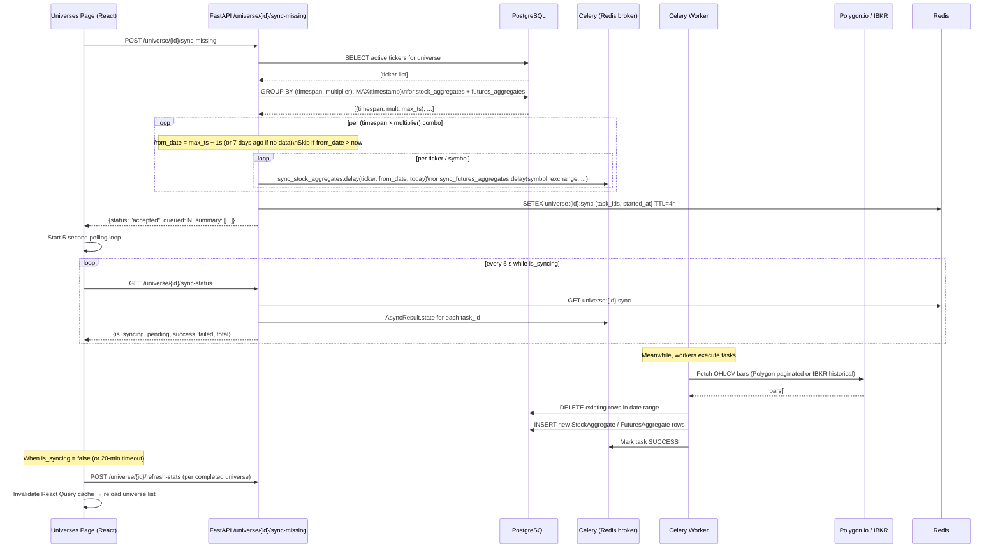

# Architecture

## Service Topology

All services run as Docker containers on the `stockscanner-network` bridge network. Inter-service communication uses container names as hostnames.

```
                         ┌─────────────────────────────────────────┐
                         │          stockscanner-network            │
                         │                                          │
  Browser ──HTTP:3000──> │ frontend ──HTTP──> backend:8000          │
                         │   │ WS:3000/api/live/ws/*                │
                         │                       │                  │
                         │                  asyncpg ──> postgres:5432
                         │                  aioredis ──> redis:6379  │
                         │                  ib_insync ──> ib-gateway:4004
                         │                  HTTPS ──> api.polygon.io │
                         │                  HTTP ──> seq:5341        │
                         │                                          │
                         │ live-scanner ──> postgres:5432           │
                         │              ──> redis:6379              │
                         │              ──> ib-gateway:4004         │
                         │                                          │
                         │ celery-worker ──> (same: DB, Redis, IBKR, Polygon)
                         │ celery-beat ──> redis:6379 (broker only) │
                         │ flower:5555 ──> redis:6379               │
                         │ pgadmin:5050 ──> postgres:5432           │
                         │ seq:5380/5341 ──> seq_data volume        │
                         └─────────────────────────────────────────┘
```

## Scan Execution Flow

A full pre-market scan proceeds as follows:

1. **Trigger** — Celery Beat fires `run_scanner` at a scheduled time, or a user POSTs to `/api/scanner/run`.
2. **Session classification** — `ScannerService.calculate_day_metrics()` (`services/scanner.py`) determines the active market session (pre-market 04:00–09:30, regular, post-market) using `ZoneInfo("America/New_York")`, then maps session boundaries to UTC for database queries.
3. **Ticker list** — The service resolves the universe's ticker list from `StockUniverseTicker` records.
4. **Parallel data fetch** — Tickers are fetched from Polygon in batches. An `asyncio.Semaphore(10)` bounds concurrency to 10 in-flight requests; `asyncio.gather()` parallelises within that bound.
5. **Batch enrichment** — `_get_batch_enrichment_data()` fetches all `TickerReference` metadata for the full batch in a single DB round-trip (eliminates per-ticker N+1 queries).
6. **News catalyst analysis** — `CatalystParser.analyze_batch()` (`services/catalyst_parser.py`) queries the `NewsArticle` table once for a 72-hour window covering all tickers, then matches articles to tickers in memory.
7. **Criteria evaluation** — Each ticker is evaluated against the five scanner criteria (see README). Passing tickers produce `ScannerEvent` records.
8. **Persistence** — A `ScannerRun` row is written with metadata; `ScannerEvent` rows are written for each hit.
9. **Delivery** — The frontend polls `/api/scanner/results` via React Query. Live pushes are broadcast through `services/websocket_manager.py`.

## Backend Module Map

### Core (`app/core/`)

| File | Responsibility |
|------|---------------|
| `config.py` | `Settings` class; reads all env vars with typed defaults. Accessed via `get_settings()` (cached). |
| `database.py` | Async SQLAlchemy engine and session factory (`AsyncSession`). `get_db()` dependency. |
| `celery_app.py` | Celery instance; beat schedule definitions (scan times, sync intervals). |
| `error_tracking.py` | `ErrorTracker` protocol; `SeqErrorTracker` and `StdoutErrorTracker` implementations; MD5-based `ErrorId` generation. |

### Services (`app/services/`)

| File | Responsibility |
|------|---------------|
| `scanner.py` | Core scan orchestration: `ScannerService`, `calculate_day_metrics()`, `_get_batch_enrichment_data()` (returns 3-tuple with ES/NQ market context and sector ETF pct changes), Phase 2a 19-key feature enrichment in `run_pre_market_scan()`. Loads `signal_ranker_config` once per scan; passes to `_save_event()` for scoring. |
| `signal_ranker.py` | Phase 2c signal quality scorer. `compute_signal_quality_score()` — weighted sum of normalized indicators (re-normalizes over present features). `load_ranker_config()` — reads `signal_ranker_enabled`, `signal_ranker_weights`, `signal_ranker_version` from `SystemConfig`. Weights updatable without redeploy. |
| `stock_data.py` | Historical OHLCV fetch, gap percentage calculation, per-ticker session flag logic. |
| `discovery_service.py` | Bulk ticker sync from Polygon: paginated reference data, rate-limit-aware batching. |
| `catalyst_parser.py` | Batch 72-hour news analysis for catalyst detection. Joins articles to tickers in memory. Returns `latest_article_utc` per ticker for catalyst recency enrichment. |
| `futures_data.py` | Futures contract data (ES, NQ, etc.), rollover date tracking. |
| `chart_indicators.py` | Technical indicator computation (e.g., VWAP, moving averages) for chart endpoints. |
| `journal_service.py` | Trade journal CRUD operations. |
| `websocket_manager.py` | WebSocket connection pool; `broadcast()` to all connected clients. |
| `normalization.py` | Data normalization helpers (price/volume units, split adjustments). |
| `data_quality.py` | Quality checks and `UniverseQualityReport` generation. |
| `stats.py` | Aggregate statistics helpers for dashboard metrics. |
| `event_helpers.py` | Utility functions for `ScannerEvent` construction and querying. |
| `statistical_discovery.py` | Pure-Python statistical analysis service: `build_feature_matrix`, `compute_correlations` (Pearson + Spearman), `compute_shap_weights` (LightGBM + SHAP), `run_kmeans`, `compute_conditional_stats`, `generate_label`. No DB dependencies; accepts DataFrames, returns typed dicts. |

### Providers (`app/providers/`)

| File | Responsibility |
|------|---------------|
| `base.py` | `MarketDataProvider` abstract interface (fetch bars, tickers, news). |
| `massive.py` | Polygon.io bulk operations: large-batch ticker sync, aggregate backfill. |
| `ibkr.py` | `ib_insync`-based Interactive Brokers provider. Connects to the `ib-gateway` container on port 4002. |

### Routers (`app/routers/`)

| File | Endpoints |
|------|-----------|
| `scanner.py` | `/api/scanner/run`, `/api/scanner/results` (default sort: `signal_quality_score DESC`), `/api/scanner/history`, `/api/scanner/signal-quality-distribution` |
| `universe.py` | `/api/universe/*` — CRUD for stock universes and memberships |
| `stocks.py` | `/api/stocks/*` — historical data, ticker search, stock details |
| `news.py` | `/api/news/*` — news articles and preferences |
| `live_data.py` | `/api/live/ws/{ticker}/{resolution}` — per-symbol WebSocket; `/api/live/ws/watchlist` — watchlist-wide WebSocket (all symbols + alerts) |
| `futures.py` | `/api/futures/*` — futures contracts, aggregates, rollovers |
| `journal.py` | `/api/journal/*` — trade journal entries |
| `watchlist.py` | `/api/watchlist/*` — active watchlist CRUD (list, add, update notes, remove) |
| `health.py` | `GET /health` — liveness probe |
| `system.py` | `/api/system/*` — configuration, status |
| `outcomes.py` | `/api/outcomes/*` — scorecard, intervals, distribution, edge decay, signals, event detail, backfill; `POST /analyze` (trigger analysis), `GET /correlations`, `GET /analysis/latest` |

### Database Models (`app/models/`)

| Model | Table | Purpose |
|-------|-------|---------|
| `ActiveWatchlist` | `active_watchlist` | Manually curated symbols under live observation. Soft limit: 50. Fields: `symbol`, `security_type` (STK/FUT), `exchange`, `notes`, `added_at`. |
| `ScannerRun` | `scanner_runs` | One row per scan execution; stores timing, config snapshot, hit count |
| `ScannerEvent` | `scanner_events` | One row per ticker that passed all criteria in a run. Carries `signal_quality_score` (Float, indexed DESC NULLS LAST) computed at write time by `signal_ranker.py`. Also written by the live scanner. |
| `ScannerConfig` | `scanner_configs` | Saved scanner parameter sets |
| `StockUniverse` | `stock_universes` | Named groups of tickers (e.g., "Russell 2000 Small Caps") |
| `StockUniverseTicker` | `stock_universe_tickers` | Universe membership records |
| `MonitoredStock` | `monitored_stocks` | Per-ticker tracking state and metadata |
| `StockAggregate` | `stock_aggregates` | Cached historical OHLCV bars from Polygon |
| `TickerReference` | `ticker_reference` | Polygon metadata cache (market cap, sector, CIK, FIGI, etc.) |
| `NewsArticle` | `news_articles` | Cached news from Polygon used by `CatalystParser` |
| `NewsPreference` | `news_preferences` | User news source/topic preferences |
| `StockMetric` | `stock_metrics` | Computed daily metrics (relative volume, gap %, etc.) |
| `StockSplit` | `stock_splits` | Split history for volume normalization |
| `FuturesContract` | `futures_contracts` | Contract specifications (symbol, multiplier, exchange) |
| `FuturesAggregate` | `futures_aggregates` | Futures OHLCV bars |
| `FuturesRollover` | `futures_rollovers` | Roll dates and front-month mapping |
| `MarketHoliday` | `market_holidays` | NYSE/NASDAQ holiday calendar |
| `Trade` | `trades` | Trade journal entries |
| `UniverseQualityReport` | `universe_quality_reports` | Data quality audit results per universe |
| `SignalAnalysisRun` | `signal_analysis_runs` | Anchor table for each statistical analysis execution; stores `correlation_matrix` and `feature_weights` as JSONB, status, event count |
| `SignalCluster` | `signal_clusters` | One K-means cluster archetype per analysis run; stores centroid, return_profile (per-interval stats), event count, auto-generated label |

## Frontend Architecture

### State Management

- **Server state**: React Query (`@tanstack/react-query`). All API calls go through the `api/` layer.
- **UI state**: local `useState`. No global client-side state store.
- **WebSocket**: managed in `hooks/` with reconnect logic.

### Pages

| Page | Route | Purpose |
|------|-------|---------|
| `Dashboard` | `/` | System metrics, recent alerts, market status |
| `Scanner` | `/scanner` | Run scans, view results (default sort: signal quality score), configure criteria |
| `PreMarketMovers` | `/movers/pre-market` | Real-time pre-market volume leaders |
| `Universes` | `/universes` | Create and manage stock universes |
| `EdgeExplorer` | `/edge-explorer` | Historical scanner hit rates, outcome distributions, feature correlation heatmap (Phase 2b), and Signal Quality Validation chart — avg EOD % and follow-through rate per score decile (Phase 2c) |
| `ActiveWatchlist` | `/watchlist` | Live-monitored symbols: add/remove, real-time price + session data, alert badges. Connects to `/api/live/ws/watchlist` WebSocket. |
| `Journal` | `/journal` | Trade journal entry and review |
| `Alerts` | `/alerts` | Alert configuration and history |
| `StockDetailPage` | `/stock/:ticker` | Per-ticker chart, metrics, and news |
| `Settings` | `/settings` | System configuration |

### Charting Libraries

- **Recharts** — analytics charts (bar, line, area) on Dashboard and EdgeExplorer.
- **Lightweight Charts** (TradingView) — price and volume OHLCV charts on StockDetailPage.

## Error Tracking System

All unhandled FastAPI exceptions flow through a global handler (`app/main.py`) that:

1. MD5-hashes the Python stack trace to produce a deterministic `ErrorId` (format: `ERR-xxxxxxxx`). The same code path always produces the same ID.
2. Ships a structured CLEF log event to Seq at `http://seq:5341` via HTTP.
3. Mirrors output to Python's stdlib logger (stdout) as an always-on fallback.
4. Returns to the client:
   - `ENVIRONMENT=development` → `{message, error_id, detail, stack_trace}`
   - `ENVIRONMENT=production` → `{message, error_id}` (internals hidden)

The frontend `GlobalErrorToast` component listens for `server-error` window events (fired by the shared Axios client on any HTTP 5xx). The "Trace in Seq" button navigates to `http://localhost:5380` pre-filtered to that `ErrorId`.

To add a new error tracking backend (Sentry, Datadog, Loki):
1. Implement the `ErrorTracker` protocol in `app/core/error_tracking.py`.
2. Register it in `ErrorTrackerFactory._build()` keyed to an env var.
3. The `error_id` API contract is unchanged — no frontend changes needed.

## IB Gateway Integration

The `ib-gateway` container (`ghcr.io/gnzsnz/ib-gateway:stable`) uses IBC for headless IBKR authentication.

**Port architecture** — the Gateway API binds to `localhost` only inside the container. `socat` proxies it to an externally-reachable port:

| External port | Internal target | Mode |
|--------------|----------------|------|
| **4004** | `localhost:4002` (socat) | Paper trading — all API clients use this |
| **4003** | `localhost:4001` (socat) | Live trading — unused until needed |

`READ_ONLY_API=yes` by default — order submission via the API is intentionally disabled.

**Client ID allocation:**

| Service | `clientId` |
|---------|-----------|
| `backend` / `celery-worker` | `IBKR_CLIENT_ID` env var (default 10) + `pid % 50` |
| `live-scanner` | **5** (hardcoded, dedicated) |

Each concurrent connection must use a unique `clientId`. The `live-scanner` uses a fixed ID so it never collides with the backend or Celery workers.

The health check tests the socat proxy (`socat /dev/null TCP:localhost:4004,connect-timeout=3`) and allows up to 3 minutes (18 retries × 10 s) for initial IBC authentication. First startup typically takes 45–60 seconds.

## Live Scanner

The `live-scanner` container (`backend/live_scanner/`) is a standalone asyncio process that streams real-time market data from IB Gateway for every symbol in the active watchlist, evaluates alert conditions, and publishes results to Redis.

### Hybrid data model

Two concurrent IBKR subscriptions are opened per watchlist symbol:

| Subscription | API call | Rate | Used for |
|-------------|----------|------|----------|
| Market data | `reqMktData` | Sub-second (every last-price change) | UI price display |
| Real-time bars | `reqRealTimeBars` | Every 5 seconds (IBKR minimum) | Volume accumulation, OHLCV, alert conditions |

### Data flow

```
IB Gateway
  ├── reqMktData (ticker.updateEvent)
  │     └── price changed? → queue TAG_QUOTE
  │           └── publish_quote() → Redis watchlist:live_data {"type":"quote"}
  │
  └── reqRealTimeBars (bars.updateEvent, every 5 s)
        └── queue TAG_BAR
              ├── publish_tick() → Redis stock_updates:{symbol}:second
              │                  → Redis watchlist:live_data {"type":"tick"}
              └── BarAggregator.update(bar)
                    └── minute boundary crossed?
                          ├── publish_minute_bar() → Redis stock_updates:{symbol}:minute
                          │                        → Redis watchlist:live_data {"type":"minute_bar"}
                          └── check_conditions(minute_bar)
                                └── triggered?
                                      ├── Redis SET NX EX 3600 (1-hour dedup)
                                      ├── write ScannerEvent to DB
                                      └── publish → Redis watchlist:alerts {"type":"alert"}

Redis pub/sub
  └── FastAPI /api/live/ws/watchlist (subscribes to watchlist:live_data + watchlist:alerts)
        └── WebSocket → Browser (ActiveWatchlist page)
```

### Bar aggregation and session detection

`BarAggregator` (`live_scanner/bar_aggregator.py`) accumulates 5-second bars into 1-minute `MinuteBar` objects and tracks:
- **Session type**: `pre` (04:00–09:30 ET), `regular` (09:30–16:00 ET), `post` (16:00–20:00 ET), or `closed`
- **Session volume**: cumulative volume since the current session opened (reset on session boundary)
- **Minutes elapsed**: time into the current session (used for projected-volume calculation)

### Alert conditions (`live_scanner/conditions.py`)

| Scanner type | Condition | Severity |
|-------------|-----------|----------|
| `live_volume_spike` | Projected full-session volume ≥ 4× avg daily volume | high > 8×, medium > 4× |
| `live_price_move` | `\|close − prior_close\| / prior_close ≥ 1%` | high > 5%, medium > 2% |

Both use the same `ScannerEvent` model and `event_helpers` as the batch scanner. The daily UniqueConstraint `(ticker, event_date, scanner_type)` prevents duplicate DB rows; a Redis `SET NX EX 3600` key prevents alert flooding within the same hour.

### Watchlist sync

The `_sync_loop` polls the DB every 30 seconds. Newly added symbols are subscribed immediately; removed symbols have both their `reqRealTimeBars` and `reqMktData` subscriptions cancelled.

## Celery Task Architecture

Defined in `app/tasks.py`, scheduled via `app/core/celery_app.py`:

| Task | Trigger | Purpose |
|------|---------|---------|
| `run_scanner` | Beat schedule / on-demand | Main scan execution |
| `refresh_universe_stocks` | Beat schedule | Refresh stock data for active universes |
| `sync_fundamental_data` | Beat schedule (weekly) | Bulk ticker reference sync from Polygon |
| `update_daily_metrics` | Beat schedule (daily, after close) | Compute and store daily metric snapshots |
| `analyze_signal_features` | Beat schedule (11:00 UTC weekdays) / on-demand via `POST /api/outcomes/analyze` | Phase 2b statistical discovery: correlation, SHAP feature weights, K-means clustering. Requires ≥500 complete events. Persists results to `signal_analysis_runs` and `signal_clusters`. |

Redis is used as both the Celery broker and result backend. Worker and beat run as separate containers so the scheduler doesn't compete with task execution.

---

## Catch Up Feature (Universe Aggregate Backfill)

The **Catch Up** button on the Universes page brings a universe's historical price data up to date without requiring the user to choose a date range. It is distinct from the full **Sync** operation, which downloads a user-specified range from scratch.

### What it does

1. **Discovers existing timespans** — Queries `stock_aggregates` (stocks) or `futures_aggregates` (futures) grouped by `(timespan, multiplier)` to find every resolution already stored for the universe (e.g. `1-minute`, `1-day`).
2. **Computes the gap** — For each `(timespan, multiplier)` combo, finds `MAX(timestamp)` across all tickers in the universe. The backfill window starts one second after that timestamp and ends at today. If `MAX(timestamp)` is already in the future (nothing new can exist) the combo is skipped.
3. **Queues Celery tasks** — One `sync_stock_aggregates` task per ticker per combo for equities (via Polygon/MassiveProvider); one `sync_futures_aggregates` task per symbol per combo for futures (via IBKR/FuturesDataService). Tasks auto-retry up to 3 times on failure.
4. **Stores progress in Redis** — Task IDs and a start timestamp are written to `universe:{id}:sync` with a 4-hour TTL.
5. **Polls to completion** — The frontend polls `GET /universe/{id}/sync-status` every 5 seconds, checking Celery task states. When all tasks finish (or a 20-minute client-side timeout fires), the universe's cached stats are auto-refreshed and the list reloads.

### Guard rails

| Condition | Behaviour |
|---|---|
| No active stocks in universe | Returns `skipped` — nothing queued |
| No existing aggregate rows | Returns `skipped` — use Sync first to do the initial download |
| `MAX(timestamp)` already in the future | That combo is marked "already up to date" and skipped |
| Futures symbol with unknown exchange | Warning logged, symbol skipped |
| Sync key older than 4 hours in Redis | Treated as stale, cleared, reported as not syncing |

### Flow diagram


