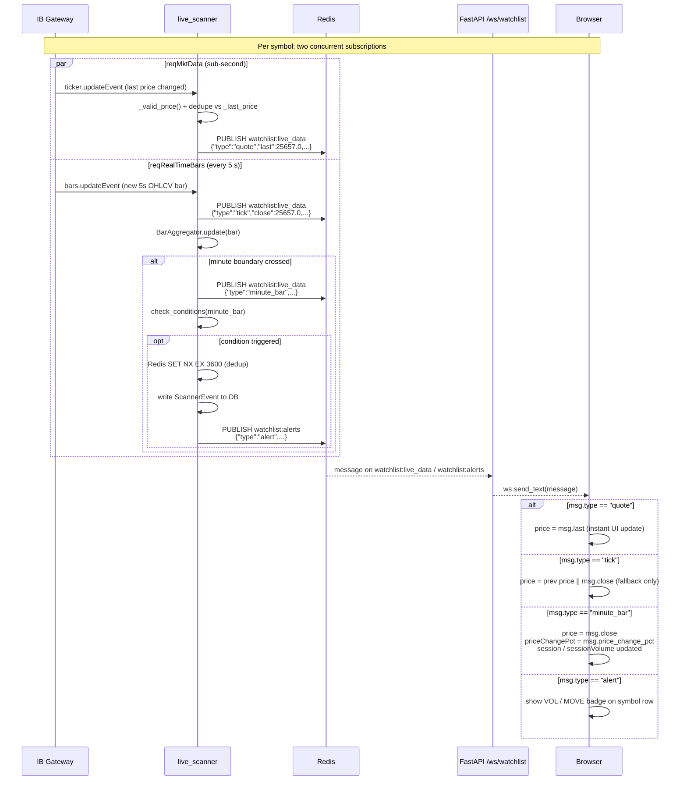

```mermaid
sequenceDiagram
participant IB as IB Gateway
participant LS as live_scanner
participant R as Redis
participant BE as FastAPI /ws/watchlist
participant FE as Browser

      Note over IB,FE: Per symbol: two concurrent subscriptions

      par reqMktData (sub-second)
          IB->>LS: ticker.updateEvent (last price changed)
          LS->>LS: _valid_price() + dedupe vs _last_price
          LS->>R: PUBLISH watchlist:live_data<br/>{"type":"quote","last":25657.0,...}
      and reqRealTimeBars (every 5 s)
          IB->>LS: bars.updateEvent (new 5s OHLCV bar)
          LS->>R: PUBLISH watchlist:live_data<br/>{"type":"tick","close":25657.0,...}
          LS->>LS: BarAggregator.update(bar)
          alt minute boundary crossed
              LS->>R: PUBLISH watchlist:live_data<br/>{"type":"minute_bar",...}
              LS->>LS: check_conditions(minute_bar)
              opt condition triggered
                  LS->>LS: Redis SET NX EX 3600 (dedup)
                  LS->>LS: write ScannerEvent to DB
                  LS->>R: PUBLISH watchlist:alerts<br/>{"type":"alert",...}
              end
          end
      end

      R-->>BE: message on watchlist:live_data / watchlist:alerts
      BE-->>FE: ws.send_text(message)

      alt msg.type == "quote"
          FE->>FE: price = msg.last (instant UI update)
      else msg.type == "tick"
          FE->>FE: price = prev price || msg.close (fallback only)
      else msg.type == "minute_bar"
          FE->>FE: price = msg.close<br/>priceChangePct = msg.price_change_pct<br/>session / sessionVolume updated
      else msg.type == "alert"
          FE->>FE: show VOL / MOVE badge on symbol row
      end
```
