# Database Schema

This document is auto-generated by `backend/scripts/generate_schema_doc.py` whenever a database migration is run.

## Entity-Relationship Diagram

```mermaid
erDiagram
    stock_universes {
        int id PK
        string uuid UK
        string name 
        string description 
        json criteria 
        datetime created_at 
        datetime updated_at 
        boolean is_active 
        int cached_ticker_count 
        int cached_aggregate_count 
        datetime cached_min_date 
        datetime cached_max_date 
        json cached_timespans 
        datetime stats_refreshed_at 
    }
    monitored_stocks {
        int id PK
        string ticker 
        string company_name 
        string sector 
        string industry 
        float market_cap 
        int universe_id 
        date added_date 
        datetime last_scanned 
        int scan_count 
        boolean is_active 
        string asset_class 
        string data_source 
        json metadata 
        datetime created_at 
        datetime updated_at 
    }
    stock_universe_tickers {
        int id PK
        int universe_id 
        string ticker 
        string asset_class 
        string data_source 
        datetime created_at 
    }
    scanner_events {
        int id PK
        string uuid UK
        string ticker 
        date event_date 
        string scanner_type 
        string summary 
        string severity 
        float previous_close 
        float opening_price 
        float closing_price 
        json indicators 
        json criteria_met 
        json metadata 
        datetime created_at 
        datetime updated_at 
    }
    scanner_configs {
        int id PK
        string uuid UK
        string name 
        string description 
        string scanner_type 
        json parameters 
        json criteria 
        boolean is_active 
        string run_frequency 
        datetime last_run 
        datetime next_run 
        json outcome_config 
        json data_requirements 
        datetime created_at 
        datetime updated_at 
    }
    scanner_runs {
        int id PK
        string uuid UK
        string scanner_type 
        int universe_id FK
        string status 
        int stocks_scanned 
        int events_detected 
        int execution_time_ms 
        string error_message 
        datetime created_at 
        date scan_start_date 
        date scan_end_date 
        string celery_task_id 
    }
    ticker_references {
        string ticker PK
        string name 
        float market_cap 
        float outstanding_shares 
        string sector 
        string industry 
        datetime last_updated 
        string description 
        string primary_exchange 
        string list_date 
        float total_employees 
        float share_class_shares_outstanding 
        float weighted_shares_outstanding 
        string sic_code 
        string sic_description 
        string homepage_url 
        datetime last_details_update 
        boolean active 
        string cik 
        string composite_figi 
        string market 
        string type 
    }
    stock_metrics {
        string ticker PK
        date date PK
        float close_price 
        float volume 
        float avg_volume_30d 
        float sma_50 
        float sma_200 
        float high_52w 
        float low_52w 
        float atr_14 
    }
    stock_aggregates {
        int id PK
        string ticker 
        datetime timestamp 
        int multiplier 
        string timespan 
        float open 
        float high 
        float low 
        float close 
        int volume 
        float vwap 
        int transactions 
        boolean is_pre_market 
        boolean is_after_market 
        string provider 
        datetime created_at 
    }
    news_articles {
        int id PK
        string uuid UK
        string title 
        string author 
        datetime published_utc 
        string article_url UK
        string image_url 
        string description 
        string provider 
        json tickers 
        datetime created_at 
        datetime updated_at 
    }
    news_preferences {
        int id PK
        string uuid UK
        json tracked_tickers 
        json tracked_universes 
        int refresh_interval_minutes 
        datetime last_polled_at 
        datetime created_at 
        datetime updated_at 
    }
    trade_tags {
        int trade_id PK
        int tag_id PK
    }
    tags {
        int id PK
        string name UK
        string color 
    }
    trades {
        int id PK
        string symbol 
        string status 
        string side 
        datetime open_date 
        datetime close_date 
        float quantity 
        float avg_entry_price 
        float avg_exit_price 
        float gross_pnl 
        float net_pnl 
        float commissions 
        float return_pct 
        string notes 
        datetime created_at 
        datetime updated_at 
    }
    trade_executions {
        int id PK
        int trade_id FK
        datetime timestamp 
        string side 
        float price 
        float quantity 
        float commission 
        string external_id 
    }
    journal_entries {
        int id PK
        date entry_date UK
        string content 
        string sentiment 
        datetime created_at 
        datetime updated_at 
    }
    stock_splits {
        int id PK
        string ticker 
        date execution_date 
        float split_from 
        float split_to 
    }
    futures_aggregates {
        int id PK
        string symbol 
        string contract_month 
        string exchange 
        datetime timestamp 
        string timespan 
        int multiplier 
        float open 
        float high 
        float low 
        float close 
        int volume 
        float vwap 
        int transactions 
        string source 
        datetime created_at 
    }
    futures_rollovers {
        int id PK
        string symbol 
        string exchange 
        string from_contract 
        string to_contract 
        date roll_date 
        string detection_method 
        datetime created_at 
        datetime updated_at 
    }
    futures_contracts {
        int id PK
        string symbol 
        string exchange 
        string contract_month 
        date expiry_date 
        int con_id 
        boolean is_expired 
        boolean data_downloaded 
        datetime last_bar_date 
        datetime first_bar_date 
        datetime created_at 
        datetime last_updated 
    }
    universe_quality_reports {
        int id PK
        int universe_id FK
        string status 
        string overall_grade 
        float overall_score 
        int ticker_count 
        datetime started_at 
        datetime generated_at 
        json report_data 
        string error_message 
        string normalization_status 
        json normalization_data 
    }
    market_holidays {
        int id PK
        string exchange 
        date date 
        string event_type 
        string description 
    }
    system_config {
        string key PK
        string value 
        datetime updated_at 
    }
    alert_rules {
        int id PK
        string name 
        boolean is_active 
        json scanner_types 
        string severity_filter 
        int cooldown_minutes 
        json channels 
        json channel_config 
        boolean auto_trade 
        int trading_strategy_id FK
        datetime created_at 
        datetime updated_at 
    }
    alert_delivery_logs {
        int id PK
        int rule_id FK
        int scanner_event_id FK
        string ticker 
        string scanner_type 
        string channel 
        string status 
        string error_message 
        datetime delivered_at 
    }
    push_subscriptions {
        int id PK
        string endpoint UK
        string p256dh 
        string auth 
        string user_agent 
        datetime created_at 
    }
    active_watchlist {
        int id PK
        string symbol UK
        string security_type 
        string exchange 
        string notes 
        datetime added_at 
    }
    trading_strategies {
        int id PK
        string name UK
        string description 
        boolean is_active 
        boolean paper_mode 
        boolean requires_approval 
        float risk_per_trade_pct 
        float max_position_usd 
        int max_trades_per_day 
        int max_concurrent_positions 
        string entry_type 
        float limit_offset_pct 
        float stop_pct 
        float risk_reward_ratio 
        float max_slippage_pct 
        json allowed_sessions 
        string direction 
        datetime created_at 
        datetime updated_at 
    }
    auto_trade_orders {
        int id PK
        int alert_rule_id FK
        int scanner_event_id FK
        int trading_strategy_id FK
        string symbol 
        string side 
        date event_date 
        string status 
        string rejection_reason 
        float trigger_price 
        float entry_price_target 
        float calculated_stop 
        float calculated_target 
        int quantity 
        float risk_amount_usd 
        boolean is_paper 
        string broker_order_id 
        string broker_stop_id 
        string broker_target_id 
        float fill_price 
        datetime filled_at 
        float exit_price 
        datetime exited_at 
        string exit_reason 
        int trade_id FK
        datetime created_at 
        datetime updated_at 
    }
    scanner_outcome_snapshots {
        int id PK
        int scanner_event_id FK
        string interval_key 
        float reference_price 
        float snapshot_price 
        float pct_change 
        float high_since_signal 
        float low_since_signal 
        int volume_since_signal 
        datetime captured_at 
        string status 
        datetime created_at 
    }
    scanner_outcome_summaries {
        int id PK
        int scanner_event_id FK
        float reference_price 
        float mfe_pct 
        int mfe_time_minutes 
        float mae_pct 
        int mae_time_minutes 
        float mfe_mae_ratio 
        float r_multiple 
        float eod_pct_change 
        boolean follow_through 
        boolean gap_filled 
        boolean is_complete 
        datetime completed_at 
        datetime created_at 
        datetime updated_at 
    }

    scanner_runs }|--|| stock_universes : "universe_id"
    stock_metrics }|--|| ticker_references : "ticker"
    trade_tags }|--|| trades : "trade_id"
    trade_tags }|--|| tags : "tag_id"
    trade_executions }|--|| trades : "trade_id"
    universe_quality_reports }|--|| stock_universes : "universe_id"
    alert_rules }|--|| trading_strategies : "trading_strategy_id"
    alert_delivery_logs }|--|| alert_rules : "rule_id"
    alert_delivery_logs }|--|| scanner_events : "scanner_event_id"
    auto_trade_orders }|--|| alert_rules : "alert_rule_id"
    auto_trade_orders }|--|| scanner_events : "scanner_event_id"
    auto_trade_orders }|--|| trading_strategies : "trading_strategy_id"
    auto_trade_orders }|--|| trades : "trade_id"
    scanner_outcome_snapshots }|--|| scanner_events : "scanner_event_id"
    scanner_outcome_summaries }|--|| scanner_events : "scanner_event_id"
```

## Indices & Constraints

### `stock_universes`
- **Index**: `ix_stock_universes_uuid` on columns: (uuid)
- **Index**: `ix_stock_universes_id` on columns: (id)
- **Unique**: `uuid`

### `monitored_stocks`
- **Index**: `ix_monitored_stocks_ticker` on columns: (ticker)
- **Index**: `ix_monitored_stocks_is_active` on columns: (is_active)
- **Index**: `ix_monitored_stocks_id` on columns: (id)
- **Index**: `ix_monitored_stocks_universe_id` on columns: (universe_id)
- **Index**: `ix_monitored_stocks_asset_class` on columns: (asset_class)
- **Index**: `ix_monitored_stocks_data_source` on columns: (data_source)

### `stock_universe_tickers`
- **Index**: `ix_universe_ticker` on columns: (universe_id, ticker)
- **Index**: `ix_stock_universe_tickers_id` on columns: (id)
- **Index**: `ix_stock_universe_tickers_universe_id` on columns: (universe_id)

### `scanner_events`
- **Index**: `ix_scanner_events_id` on columns: (id)
- **Index**: `ix_scanner_events_scanner_type` on columns: (scanner_type)
- **Index**: `ix_scanner_events_uuid` on columns: (uuid)
- **Index**: `ix_scanner_events_ticker` on columns: (ticker)
- **Index**: `ix_scanner_events_event_date` on columns: (event_date)
- **Unique**: `uuid`

### `scanner_configs`
- **Index**: `ix_scanner_configs_uuid` on columns: (uuid)
- **Index**: `ix_scanner_configs_id` on columns: (id)
- **Unique**: `uuid`

### `scanner_runs`
- **Index**: `ix_scanner_runs_id` on columns: (id)
- **Index**: `ix_scanner_runs_celery_task_id` on columns: (celery_task_id)
- **Index**: `ix_scanner_runs_uuid` on columns: (uuid)
- **Unique**: `uuid`

### `ticker_references`
- **Index**: `ix_ticker_references_ticker` on columns: (ticker)

### `stock_metrics`
- **Index**: `ix_stock_metrics_date` on columns: (date)
- **Index**: `ix_stock_metrics_ticker` on columns: (ticker)

### `stock_aggregates`
- **Index**: `ix_stock_aggregates_id` on columns: (id)
- **Index**: `idx_ticker_time` on columns: (ticker, timestamp)
- **Index**: `ix_stock_aggregates_is_after_market` on columns: (is_after_market)
- **Index**: `idx_ticker_time_pre` on columns: (ticker, timestamp, is_pre_market)
- **Index**: `ix_stock_aggregates_ticker` on columns: (ticker)
- **Index**: `ix_stock_aggregates_is_pre_market` on columns: (is_pre_market)
- **Index**: `ix_stock_aggregates_timestamp` on columns: (timestamp)

### `news_articles`
- **Index**: `ix_news_articles_uuid` on columns: (uuid)
- **Index**: `ix_news_articles_published_utc` on columns: (published_utc)
- **Index**: `ix_news_articles_id` on columns: (id)
- **Unique**: `uuid`
- **Unique**: `article_url`

### `news_preferences`
- **Index**: `ix_news_preferences_uuid` on columns: (uuid)
- **Index**: `ix_news_preferences_id` on columns: (id)
- **Unique**: `uuid`

### `tags`
- **Index**: `ix_tags_id` on columns: (id)
- **Index**: `ix_tags_name` on columns: (name)
- **Unique**: `name`

### `trades`
- **Index**: `ix_trades_side` on columns: (side)
- **Index**: `ix_trades_symbol` on columns: (symbol)
- **Index**: `ix_trades_open_date` on columns: (open_date)
- **Index**: `ix_trades_close_date` on columns: (close_date)
- **Index**: `ix_trades_id` on columns: (id)
- **Index**: `ix_trades_status` on columns: (status)

### `trade_executions`
- **Index**: `ix_trade_executions_id` on columns: (id)
- **Index**: `ix_trade_executions_timestamp` on columns: (timestamp)
- **Index**: `ix_trade_executions_external_id` on columns: (external_id)
- **Index**: `ix_trade_executions_trade_id` on columns: (trade_id)

### `journal_entries`
- **Index**: `ix_journal_entries_id` on columns: (id)
- **Index**: `ix_journal_entries_entry_date` on columns: (entry_date)
- **Unique**: `entry_date`

### `stock_splits`
- **Index**: `ix_stock_splits_execution_date` on columns: (execution_date)
- **Index**: `ix_stock_splits_ticker` on columns: (ticker)
- **Index**: `ix_stock_splits_id` on columns: (id)

### `futures_aggregates`
- **Index**: `idx_fa_symbol_contract` on columns: (symbol, contract_month)
- **Index**: `idx_fa_contract_ts` on columns: (symbol, contract_month, timestamp)
- **Index**: `ix_futures_aggregates_symbol` on columns: (symbol)
- **Index**: `idx_fa_continuous_series` on columns: (symbol, contract_month, timespan, multiplier, timestamp)
- **Index**: `idx_fa_symbol_ts` on columns: (symbol, timestamp)
- **Index**: `ix_futures_aggregates_id` on columns: (id)
- **Index**: `ix_futures_aggregates_contract_month` on columns: (contract_month)
- **Index**: `ix_futures_aggregates_timestamp` on columns: (timestamp)

### `futures_rollovers`
- **Index**: `ix_futures_rollovers_roll_date` on columns: (roll_date)
- **Index**: `idx_fr_symbol_from` on columns: (symbol, from_contract)
- **Index**: `idx_fr_symbol_date` on columns: (symbol, roll_date)
- **Index**: `ix_futures_rollovers_symbol` on columns: (symbol)
- **Index**: `ix_futures_rollovers_id` on columns: (id)

### `futures_contracts`
- **Index**: `ix_futures_contracts_symbol` on columns: (symbol)
- **Index**: `idx_fc_symbol_month` on columns: (symbol, contract_month)
- **Index**: `idx_fc_symbol_exchange` on columns: (symbol, exchange)
- **Index**: `ix_futures_contracts_id` on columns: (id)

### `universe_quality_reports`
- **Index**: `ix_universe_quality_reports_universe_id` on columns: (universe_id)
- **Index**: `ix_universe_quality_reports_id` on columns: (id)
- **Unique**: `universe_id`

### `market_holidays`
- **Index**: `ix_market_holidays_exchange` on columns: (exchange)
- **Index**: `ix_market_holidays_date` on columns: (date)
- **Index**: `ix_market_holidays_id` on columns: (id)

### `system_config`
- **Index**: `ix_system_config_key` on columns: (key)

### `alert_rules`
- **Index**: `ix_alert_rules_trading_strategy_id` on columns: (trading_strategy_id)
- **Index**: `ix_alert_rules_id` on columns: (id)

### `alert_delivery_logs`
- **Index**: `ix_alert_delivery_logs_scanner_event_id` on columns: (scanner_event_id)
- **Index**: `ix_alert_delivery_logs_rule_id` on columns: (rule_id)
- **Index**: `ix_alert_delivery_logs_ticker` on columns: (ticker)
- **Index**: `ix_alert_delivery_logs_id` on columns: (id)

### `push_subscriptions`
- **Index**: `ix_push_subscriptions_id` on columns: (id)
- **Index**: `ix_push_subscriptions_endpoint` on columns: (endpoint)
- **Unique**: `endpoint`

### `active_watchlist`
- **Index**: `ix_active_watchlist_id` on columns: (id)
- **Index**: `ix_active_watchlist_symbol` on columns: (symbol)
- **Unique**: `symbol`

### `trading_strategies`
- **Index**: `ix_trading_strategies_id` on columns: (id)
- **Unique**: `name`

### `auto_trade_orders`
- **Index**: `ix_auto_trade_orders_trading_strategy_id` on columns: (trading_strategy_id)
- **Index**: `ix_auto_trade_orders_trade_id` on columns: (trade_id)
- **Index**: `ix_auto_trade_orders_alert_rule_id` on columns: (alert_rule_id)
- **Index**: `ix_auto_trade_orders_id` on columns: (id)
- **Index**: `ix_auto_trade_orders_status` on columns: (status)
- **Index**: `ix_auto_trade_orders_scanner_event_id` on columns: (scanner_event_id)
- **Index**: `ix_auto_trade_orders_symbol` on columns: (symbol)
- **Index**: `ix_auto_trade_orders_event_date` on columns: (event_date)

### `scanner_outcome_snapshots`
- **Index**: `ix_scanner_outcome_snapshots_status` on columns: (status)
- **Index**: `ix_scanner_outcome_snapshots_scanner_event_id` on columns: (scanner_event_id)
- **Index**: `ix_scanner_outcome_snapshots_id` on columns: (id)

### `scanner_outcome_summaries`
- **Index**: `ix_scanner_outcome_summaries_id` on columns: (id)
- **Index**: `ix_scanner_outcome_summaries_scanner_event_id` on columns: (scanner_event_id)
- **Index**: `ix_scanner_outcome_summaries_is_complete` on columns: (is_complete)
- **Unique**: `scanner_event_id`
