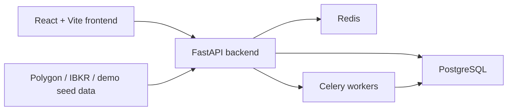
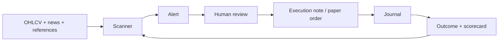

# MarketHawk

MarketHawk is an AI-First human-in-the-loop market scanning cockpit for turning market data, news, scanner hits, alerts, reviews, execution notes, journal entries, and outcomes into a repeatable trader workflow.

> MarketHawk helps you understand scanner behavior. It does not provide financial advice, guarantee trading results, or replace broker-side risk controls.

## What MarketHawk Is

- An AI-First full-stack scanner workflow for active traders who want a repeatable review loop.
- A local-first research and monitoring cockpit that connects data, scanners, alerts, reviews, journal notes, and outcomes.
- A way to make scanner ideas observable: which signals fired, what reviewers decided, what happened after the signal, and what should be improved.
- A practical bridge between discretionary review and systematic evidence.

## What MarketHawk Is Not

- It is not a broker or broker replacement.
- It is not a promise of profitable trading.
- It is not a pure vectorized research engine like vectorbt.
- It is not a full institutional backtesting engine like Lean or NautilusTrader.
- It is not a substitute for risk controls, compliance, or human judgment.

## Five-Minute Demo

Run a complete demo without IBKR, Polygon, X, or live credentials:

```bash
make demo
```

Then open:

| Surface | URL |
|---|---|
| App | http://localhost:3333 |
| API | http://localhost:8000 |
| API docs | http://localhost:8000/docs |

Demo login:

| Username | Password |
|---|---|
| `demo` | `markethawk-demo` |

The demo resets only demo-owned Docker volumes. It does not touch normal development or live MarketHawk volumes.

## Demo Walkthrough

1. Open the app and log in with the demo account.
2. Review seeded scanner events for NVDA, AMD, MSFT, TSLA, and AMZN.
3. Open the active watchlist to see symbols promoted from scanner context.
4. Inspect review cards with confirmed, rejected, and enhanced verdicts.
5. Open outcome/scorecard views to see fake follow-through, MFE/MAE, and end-of-day results.
6. Open the journal to see example execution notes and trade outcomes.

## Architecture



MarketHawk uses a React/Vite frontend, a FastAPI backend, PostgreSQL for durable workflow state, Redis/Celery for background work, and provider adapters for live or historical data. Demo mode swaps live providers for deterministic seed data so the product can be understood without credentials.

## Data Flow



The core loop is evidence-driven: data produces scanner events, scanner events become alerts and review cards, reviewer decisions inform execution notes and journal entries, and outcomes feed back into scanner quality.

## Local Install With Sample Data

Use demo mode for the fastest sample-data setup:

```bash
make demo
```

Use the full development stack when connecting real providers:

```bash
cp .env.example .env
docker compose up -d
```

The full stack can include PostgreSQL, Redis, FastAPI, React/Vite, Celery, IB Gateway, monitoring, alerting, and optional forecasting workers depending on enabled profiles and environment variables.

## Screenshots and GIFs

The static docs site includes placeholder assets in `docs/site/assets/`. Replace them with captured dashboard, scanner, review, and scorecard screenshots as the public demo stabilizes.

## Comparison

| Tool | Primary Positioning | Best At | MarketHawk Difference |
|---|---|---|---|
| MarketHawk | AI-First human-in-the-loop scanner cockpit | Reviewing live-ish signals, watchlists, alerts, outcomes, and journal context together | Optimized for the scanner-review-outcome loop rather than pure backtesting |
| Lean | Institutional-grade algorithmic trading platform | Multi-asset backtesting, live deployment, brokerage integrations | MarketHawk is lighter and focused on scanner operations and human review |
| NautilusTrader | Production-grade Rust-native trading engine | Low-latency, event-driven strategy execution | MarketHawk prioritizes explainable scanner workflow over engine-level execution |
| vectorbt | Test thousands of ideas quickly | Vectorized research and parameter sweeps | MarketHawk captures review decisions, alerts, and outcomes around operational scanner use |
| backtrader | Ease-of-use Python backtesting | Scriptable local strategy backtests | MarketHawk is a full-stack scanner cockpit with UI, alerting, review, and journal surfaces |
| pysystemtrade | Systematic futures trading research | Portfolio/system research and futures workflows | MarketHawk focuses on equity scanner signals and operator review workflows |

## Roadmap

- Reproducible demo screenshots and GIFs.
- Stronger scanner scorecards and interval outcome analysis.
- Safer broker integration boundaries for paper execution.
- More import/export paths for journals and signal reviews.
- Public docs expansion for scanner design and operational playbooks.

## Safety and Risk

MarketHawk is research and workflow software. Trading involves substantial risk of loss. Sample data, fake outcomes, scanner scores, and demo records are illustrative only. Do not use demo settings for live trading.

## Documentation

| Document | Contents |
|---|---|
| [docs/site/index.html](docs/site/index.html) | Static public docs site |
| [DEVELOPMENT.md](DEVELOPMENT.md) | Local setup and troubleshooting |
| [ARCHITECTURE.md](ARCHITECTURE.md) | System architecture details |
| [ENV_VARIABLES.md](ENV_VARIABLES.md) | Environment variable reference |
| [deployment-guide.md](deployment-guide.md) | Deployment and hardening notes |
