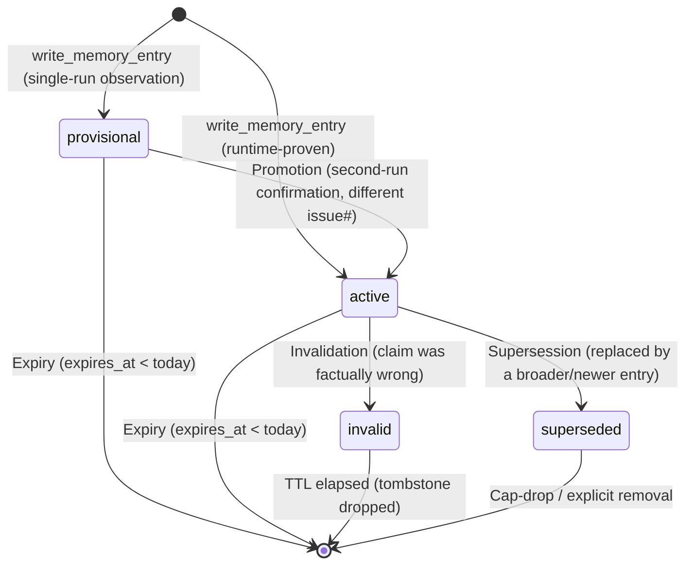

# Implementation Plan: Dark Factory Memory Contract and Structured Schema

**Date:** 2026-06-27
**Issue:** #645
**Branch:** refine/issue-645-define-dark-factory-memory-contract-and-
**Spec:** docs/superpowers/specs/2026-06-27-dark-factory-memory-contract-design.md

## Goal

Write a single reference document at `docs/agents/dark-factory-memory-contract.md` that defines the stable contract between the Dark Factory's `.archon/memory/*.md` flat files, the pipeline gates that read and write them, and a future structured memory backend. Add a one-line pointer in `CLAUDE.md`. No code changes.

## Architecture

Documentation-only change. The deliverable is pure Markdown. The two target files are:

1. `docs/agents/dark-factory-memory-contract.md` — new file, five-section reference
2. `CLAUDE.md` — append one bullet to the "Agent Skills" section

No backend, frontend, Docker, or script changes are in scope.

## Tech Stack

- Markdown (no dependencies)
- Mermaid (state chart embedded in the contract doc for lifecycle transitions — the doc owns these facts)

## File Structure

| File | Status | Purpose |
|---|---|---|
| `docs/agents/dark-factory-memory-contract.md` | CREATE | Full schema, lifecycle, write bar, scoping matrix, backwards compat |
| `CLAUDE.md` | EDIT | One-line pointer in Agent Skills section |

---

## Task 1 — Create `docs/agents/dark-factory-memory-contract.md`

**Files:** `docs/agents/dark-factory-memory-contract.md`

### Pre-condition check
```bash
# Verify the file does not already exist
ls docs/agents/dark-factory-memory-contract.md 2>/dev/null && echo "EXISTS — abort" || echo "OK — proceed"

# Confirm docs/agents/ directory exists
ls docs/agents/
# Expected output includes: domain.md  issue-tracker.md  triage-labels.md
```

### Write the file

Create `docs/agents/dark-factory-memory-contract.md` with the following exact content:

```markdown
# Dark Factory Memory Contract

**Status:** active
**Maintainer:** dark-factory refinement pipeline
**Source issue:** #645 (epic #643)

This document is the stable contract between:

1. The flat-file format in `.archon/memory/*.md` (the current authoritative store)
2. The Dark Factory gates that read and write it (`gate_lib.sh`, `route_memory_file()`)
3. A future structured backend that would replace or sit beneath the flat files

All pipeline phases, prompts, and gates must conform to this contract. When a prompt
and this document diverge, update the prompt.

---

## 1. Schema Field Table

Fields the future structured backend must support. The "Flat-file representation" column
maps each field to its current `.archon/memory/*.md` encoding.

| Field | Type | Flat-file representation |
|---|---|---|
| `id` | string (UUID/slug) | *(none — positional; use `file:line` as surrogate)* |
| `type` | enum: `pattern`, `avoidance`, `fix` | `[PATTERN]`, `[AVOID]`, `[FIX]` tag prefix |
| `status` | enum: `active`, `provisional`, `invalid`, `superseded` | `[PROVISIONAL]` or `[INVALID: reason]` prefix; `active` is the implicit default |
| `confidence` | float 0–1 | `provisional` → < 0.5; `active`/`[PATTERN]` → ≥ 0.8 |
| `source` | enum: `bootstrap`, `refine`, `implement`, `conformance`, `code-review` | `source:` inline comment token |
| `created_at` | ISO-8601 date | `date:YYYY-MM-DD` inline comment token |
| `updated_at` | ISO-8601 date | *(none — flat-file entries are immutable; use `created_at` as surrogate)* |
| `expires_at` | ISO-8601 date | `expires:YYYY-MM-DD` inline comment token |
| `supersedes` | string (id of replaced entry) | *(implicit — dedup/cap-drop in favour of newer entry; no explicit flat-file tag)* |
| `project` | string | *(implicit — file lives in `omniscient/markethawk` repo; hardcoded by convention)* |
| `agent_id` | string | *(implicit — phase + `issue_number` identifies the run; no flat-file tag)* |
| `phase` | enum: `refine`, `implement`, `conformance`, `code-review` | Overlaps with `source:` |
| `issue_number` | int | `issue:#N` inline comment token |
| `pr_number` | int | *(none — not tracked in flat-file)* |
| `files` | string[] | `path:file/prefix` inline comment token |
| `concepts` | string[] | *(none — free-text tagging not yet in flat-file; future-only)* |
| `content` | string | Text body of the entry after the `[TAG]` prefix |
| `rationale` | string | `**Why:**` line in the entry body (for feedback-type entries) |

---

## 2. Tag and Lifecycle State Mapping

### Entry types and status values

| Flat-file tag | Structured `type` | Structured `status` | Meaning |
|---|---|---|---|
| `[PATTERN]` | `pattern` | `active` | Observed, validated approach — use it |
| `[AVOID]` | `avoidance` | `active` | Confirmed anti-pattern — never do this |
| `[FIX]` | `fix` | `active` | Specific corrective action for a known class of bug |
| `[PROVISIONAL]` (in provisional section) | *(any)* | `provisional` | Single-run observation; unvalidated |
| `[INVALID: reason]` | *(original type)* | `invalid` | Claim was factually wrong; tombstoned |
| *(implied by dedup/cap-drop)* | *(original type)* | `superseded` | Claim was once correct; replaced by a broader/newer entry |

### Lifecycle transitions (four distinct paths — must not be conflated)



**1. Expiry** — `active` or `provisional` → auto-dropped when `expires_at < today`.
   Implemented by the awk block that runs before any file append in `gate_lib.sh`.

**2. Invalidation (R5)** — `active` → `status=invalid`. The entry text is rewritten from
   `[PATTERN]` to `[INVALID: reason]`. Used when the claim is **factually wrong**.
   The tombstone stays during its TTL to prevent re-addition of the same wrong claim.
   Does **not** imply there is a replacement entry.

**3. Supersession** — `active` → `status=superseded`. The newer entry (B) has broader or
   more accurate scope; entry A was once correct but is now outdated. In the flat-file,
   supersession is expressed **implicitly**: B is appended, A is removed by the R4 cap-drop
   (with a `scope covered by newer entry` comment) or R3 dedup. In the structured backend, B
   carries `supersedes: A.id` and A transitions to `status=superseded`.
   **Supersession is not invalidation** — A was never wrong; it is merely outdated. Conflating
   the two destroys the "was this ever right?" signal agents use when weighting historical context.

**4. Promotion** — `provisional` → `active`. A `[PROVISIONAL]` entry is promoted to
   `[PATTERN]` when confirmed by a *different* issue number in a later pipeline run.
   Implemented by the implement agent's cross-run confirmation check.

---

## 3. Write Bar

An entry may only become durable memory if it passes this bar:

> **"Would a future agent make a materially different architectural decision because of
> this entry, compared to reading `CLAUDE.md` and `ARCHITECTURE.md` alone?"**
>
> If no → skip.

### Per-phase thresholds

| Phase | When to write | What to write |
|---|---|---|
| **Refine** | Only when a trade-off between two approaches was explicitly weighed in Phase 4 Q&A. Most refine runs add zero entries. | Architectural decisions to `architecture.md` only (see scoping matrix). |
| **Implement** | Only when a pattern is runtime-proven in the delivered code. Single-run observations that cannot be verified via code go to `[PROVISIONAL]` first. | Area-specific patterns (backend, frontend, dark-factory-ops, codebase). Promoted from `[PROVISIONAL]` only when a different issue confirms them. |
| **Conformance** | Only when a MATERIAL violation was found **and** successfully remediated in the same run (`CONFORMANCE_CYCLE > 0`). | `[AVOID]` entries in the area file matching the violation. |
| **Code-review** | Only when `STATUS=BLOCKED` (confirmed blocking findings that were acted on). | `[AVOID]` entries in the area file matching the finding. |

### Always prohibited

- Entries that duplicate content already in `CLAUDE.md` or `ARCHITECTURE.md`
- Ephemeral task details or current-conversation context
- Debug solutions already visible in the committed code
- Git history summaries (authorship, what changed)

---

## 4. Scoping Rules: Writer-Role × Memory-File Matrix

### Authorised writers per file

| Memory file | Authorised writers | Trigger condition |
|---|---|---|
| `architecture.md` | **refine only**; bootstrap (seed) | Trade-off explicitly weighed in Phase 4 Q&A |
| `backend-patterns.md` | implement, conformance, code-review; refine (PATTERN only) | Runtime-proven pattern / material AVOID finding in backend code |
| `frontend-patterns.md` | implement, conformance, code-review; refine (PATTERN only) | Runtime-proven pattern / material AVOID finding in frontend code |
| `dark-factory-ops.md` | implement, conformance, code-review; refine (PATTERN only) | Runtime-proven pattern / material AVOID finding in factory scripts/config |
| `codebase-patterns.md` | implement, conformance, code-review — **refine is forbidden** | Runtime-proven cross-cutting lessons only |

### Read-only roles

**Plan, validate, revise-advisory** load memory at Phase 1 via `load_memory()` but never write
(`git add .archon/memory/` is absent from their scripts). They are consumers only.

### Bootstrap provenance

The `bootstrap` source tag marks entries written before the pipeline ran (one-time seed origin).
It is not a recurring role; no command file exists for it.

### Scoping primitives (inline comment tokens)

All are written as `<!-- token:value -->` comment at the end of the entry line:

| Token | Meaning |
|---|---|
| `source:<role>` | Identifies the writer role (provenance). Always required. |
| `path:<prefix>` | Area scoping. Entries with `path:` are filtered at load time against `AFFECTED` (files changed on the branch). Entries without `path:` are always included (backward-compatible default). |
| `issue:#N` | Ties the entry to its originating issue for audit and expiry TTL tracking. |
| `date:YYYY-MM-DD` | Write date. Always required. |
| `expires:YYYY-MM-DD` | Absolute expiry. Typical TTL is 6 months from `date:`. |

### Quota limits

| Quota | Limit | Enforcement |
|---|---|---|
| Authoritative entries per file (`[PATTERN]` + `[AVOID]` + `[FIX]`) | Cap 30 (R4) | Oldest/lowest-signal entries dropped before committing when cap is reached |
| Provisional entries per file | Cap 10 | Same drop mechanism |

Quota enforcement is the flat-file implementation of supersession: when a newer entry displaces
an older one under the cap, the older entry is `status=superseded` even though no explicit tag
is added. The drop comment `scope covered by newer entry` records the reason.

---

## 5. Backwards Compatibility

The `.archon/memory/*.md` flat-file format is the **authoritative read/write interface** until
a structured backend is formally adopted. Migrating storage before establishing equivalence would
silently break the pipeline.

### Stable guarantees

The following are format invariants. No pipeline change may alter them without a breaking-change
notice and migration plan:

- **Tag prefixes** (`[PATTERN]`, `[AVOID]`, `[FIX]`, `[PROVISIONAL]`, `[INVALID]`) are stable — no renames.
- **Inline comment tokens** (`source:`, `date:`, `expires:`, `issue:`, `path:`) are stable — the flat-file is the source of truth for any migration field mapping.
- **Section delimiter** — the `---` line separating the authoritative section from the provisional section is a format invariant; tooling must not delete it.
- **Any structured backend** must be able to ingest all entries in the current `.archon/memory/*.md` files without data loss.

### Migration path (when a structured backend is adopted)

1. Define a migration mapping from every inline comment token to the corresponding schema field (see §1).
2. Run a migration script that reads each `.archon/memory/*.md` file and inserts rows into the structured store.
3. Validate that the structured store produces identical `load_memory()` output for a representative `AFFECTED` file set.
4. Update `gate_lib.sh` reader and writer functions to use the structured backend.
5. Update this document's status to `migrated` and point to the new backend's schema doc.
```

### Verify structure
```bash
# Confirm the file was written and all required sections are present
grep -c "^## " docs/agents/dark-factory-memory-contract.md
# Expected: 5 (the five section headers)

grep -E "^\| `(id|type|status|confidence|source|created_at|updated_at|expires_at|supersedes|project|agent_id|phase|issue_number|pr_number|files|concepts|content|rationale)` \|" \
  docs/agents/dark-factory-memory-contract.md | wc -l
# Expected: 18 (all 18 schema fields)

grep -E "^\*\*(1|2|3|4)\." docs/agents/dark-factory-memory-contract.md | wc -l
# Expected: 4 (four lifecycle transition definitions)

grep "architecture.md\|backend-patterns.md\|frontend-patterns.md\|dark-factory-ops.md\|codebase-patterns.md" \
  docs/agents/dark-factory-memory-contract.md | wc -l
# Expected: at least 5 rows (one per file in the scoping matrix)

grep "backwards compat\|format invariant\|authoritative read/write" \
  docs/agents/dark-factory-memory-contract.md -i | wc -l
# Expected: at least 2 (backwards compat section present)
```

### Commit
```bash
git add docs/agents/dark-factory-memory-contract.md
git commit -m "docs: add Dark Factory memory contract — schema, lifecycle, and scoping matrix (#645)"
```

Expected output: `1 file changed, N insertions(+)`

---

## Task 2 — Add one-line pointer to `CLAUDE.md`

**Files:** `CLAUDE.md`

### Pre-condition check
```bash
# Confirm Agent Skills section exists and memory contract is not already there
grep -n "Agent Skills" CLAUDE.md
grep "dark-factory-memory-contract" CLAUDE.md && echo "ALREADY PRESENT" || echo "OK — proceed"
```

### Edit CLAUDE.md

In the `## Agent Skills` section (currently lines 164–169), append one bullet after the
`Architecture review` line:

**Existing content (lines 168–169):**
```
- **Architecture review** — `/architecture-review` regenerates the comparable Architecture & Quality report series in `docs/architecture-reviews/` (frozen 16-dimension rubric + DORA + code-health sections). See `.claude/skills/architecture-review/SKILL.md`.
```

**After edit — add immediately after the architecture review bullet:**
```
- **Memory contract** — stable schema, lifecycle rules, and scoping matrix for `.archon/memory/*.md`. See `docs/agents/dark-factory-memory-contract.md`.
```

Use the Edit tool with this exact replacement:

old_string:
```
- **Architecture review** — `/architecture-review` regenerates the comparable Architecture & Quality report series in `docs/architecture-reviews/` (frozen 16-dimension rubric + DORA + code-health sections). See `.claude/skills/architecture-review/SKILL.md`.
```

new_string:
```
- **Architecture review** — `/architecture-review` regenerates the comparable Architecture & Quality report series in `docs/architecture-reviews/` (frozen 16-dimension rubric + DORA + code-health sections). See `.claude/skills/architecture-review/SKILL.md`.
- **Memory contract** — stable schema, lifecycle rules, and scoping matrix for `.archon/memory/*.md`. See `docs/agents/dark-factory-memory-contract.md`.
```

### Verify
```bash
grep "dark-factory-memory-contract" CLAUDE.md
# Expected: one line containing "Memory contract" and the doc path

grep -A5 "## Agent Skills" CLAUDE.md
# Expected: bullet list now has 5 entries, last being the memory contract pointer
```

### Commit
```bash
git add CLAUDE.md
git commit -m "docs: add memory contract pointer to CLAUDE.md Agent Skills (#645)"
```

Expected output: `1 file changed, 1 insertion(+)`

---

## Memory Patterns Applied

**From `codebase-patterns.md`:**
- `[PATTERN] Mermaid diagrams belong in the file that owns their facts` — the lifecycle state chart is placed in `dark-factory-memory-contract.md` because that file IS the authority for lifecycle facts. No standalone diagram file is created.

**From `architecture.md`:**
- `[AVOID] Do not store agent memory in CLAUDE.md` — the plan adds only a one-line pointer (a reference), not memory entries themselves. This is consistent with the existing pattern for `issue-tracker.md`, `triage-labels.md`, and `domain.md`.

---

## Summary

| # | Task | Files | Steps |
|---|---|---|---|
| 1 | Create memory contract document | `docs/agents/dark-factory-memory-contract.md` | Pre-check → write → verify structure → commit |
| 2 | Add CLAUDE.md pointer | `CLAUDE.md` | Pre-check → edit → verify → commit |

**Total:** 2 tasks, 8 steps, ~10 minutes implementation time.
